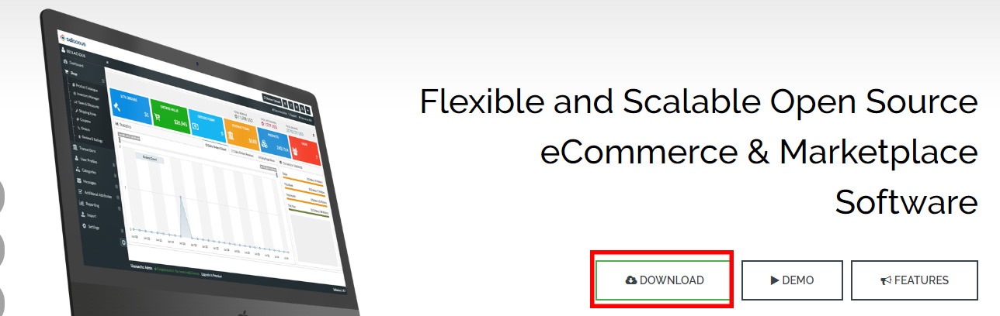
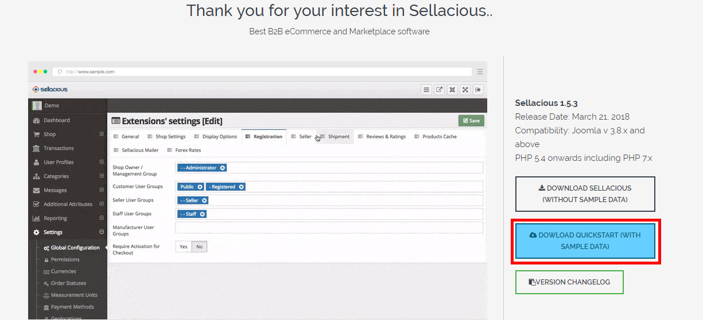
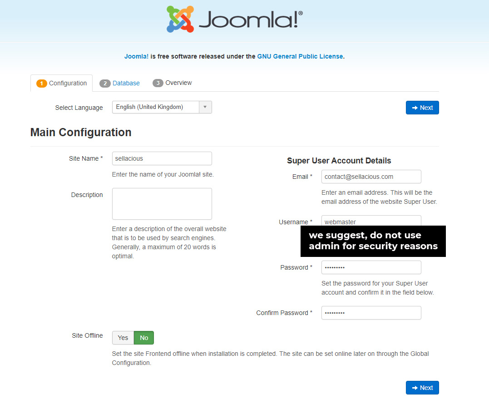
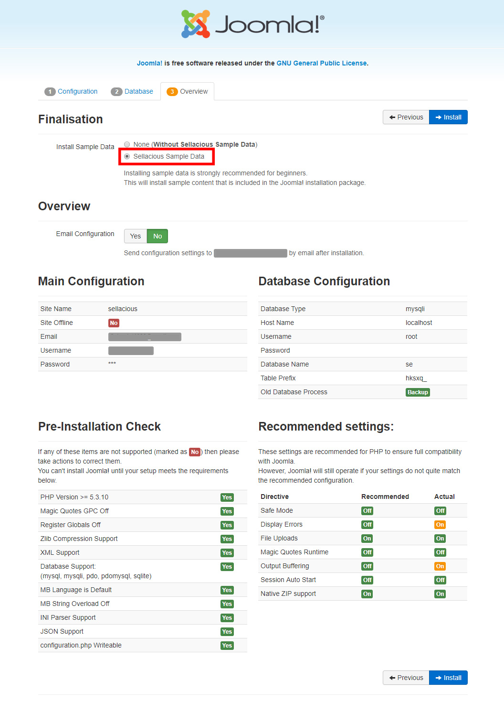
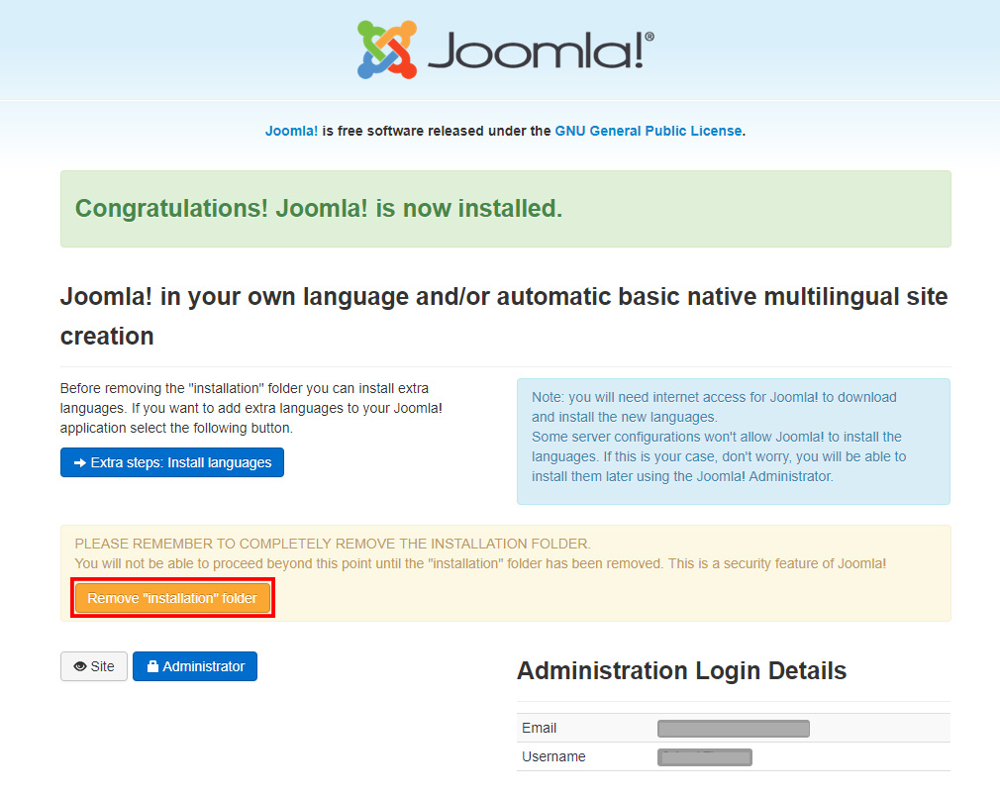

Quickstart installation is very easy to install same as the joomla installation.The quickstart package is a free and it consists of sample data with the template named 'squick'.

1.Go to www.sellacious.com

2. Download the quickstart package from here.

3. Unzip the Quickstart package and extract it in the site folder of your online/local server.
4. If you are installing it on a online server, create a MySQL database and assign it a user with full privileges.
5. Open your browser. For local server, navigate to the folder containing the Quickstart package files(i.e. localhost/folder). For online server, navigate to your main domain or appropriate subdomain (i.e http://mydomain.com/), depending on where you have uploaded the Quickstart installation package.
6. You will be redirected to the <strong>Joomla Web Installer</strong>.
7. Fill the required fields mentioned on the Joomla Web Installer screen.(We suggest you to not use 'admin' as your administrator username!)

8. Please make sure that you choose the Sample Data as an option. This will install the Sellacious sample data.

9. After successful installation, please remove the installation folder by clicking the option.

10. You can login to the administrator panel by www.domain.com/administrator.

