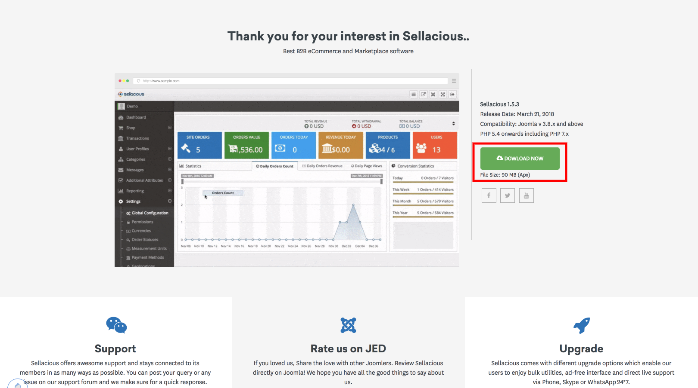
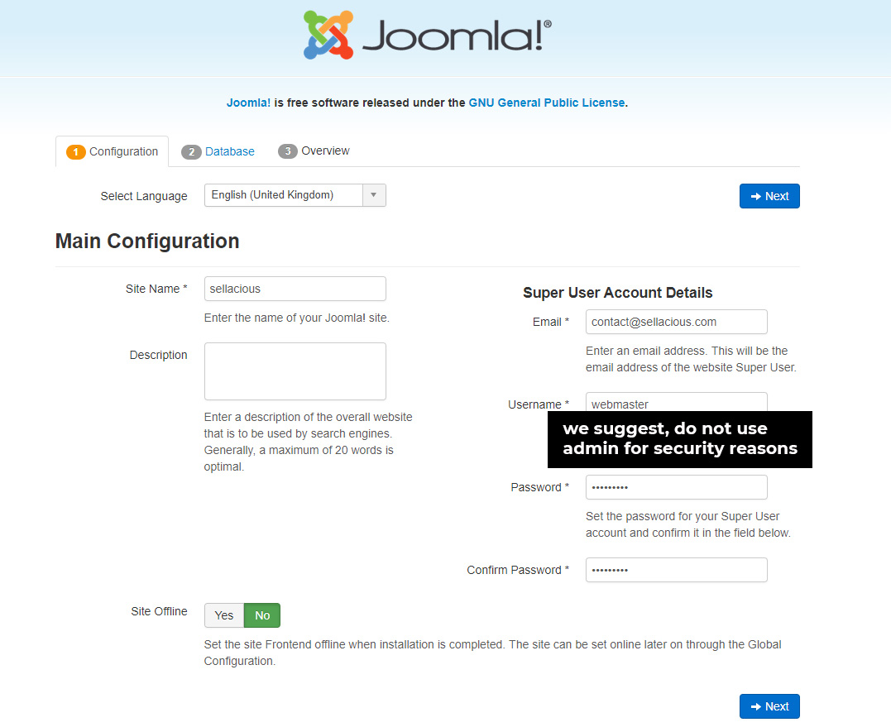
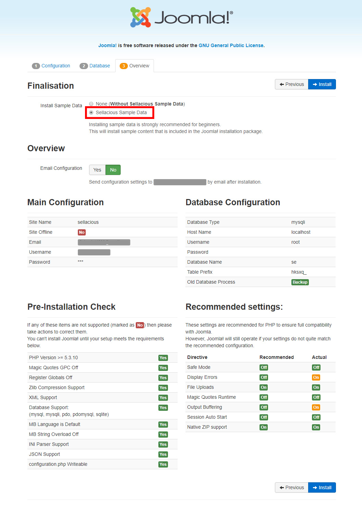
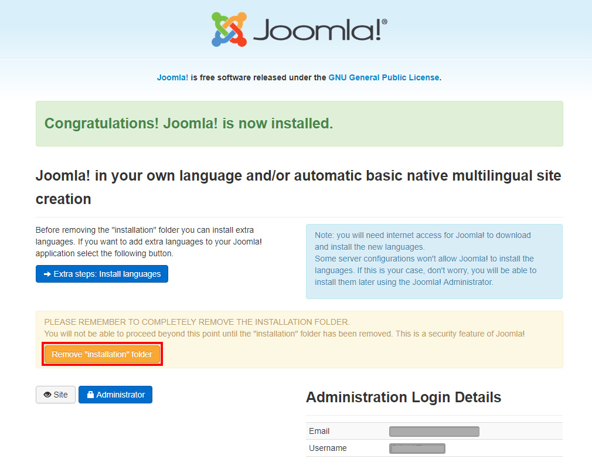
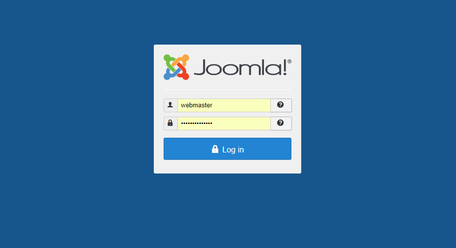

When you download Sellacious you will find quickstart of sellacious under folder "Demo Clone" 
Installing this will create exact replica of what you see on our demo. This is for both multi vendor and single vendor ecommerce. Configuring correctly will convert a simple single vendor ecommerce to multivendor marketplace and a multi vendor marketplace to simple single vendor ecommerce.  

Quickstart installation is very easy to install same as the joomla installation.The quickstart package is a free and it consists of sample data with the template named 'squick'. It normaly takes just 10 minutes to create a multivendor website using our quickstart.

1. Download the quickstart package following steps mentioned in "Getting started" tutorial.

2. Unzip "Demo Clone" archive to correct folder: When installing on Localhost use Http/www/htdocs folder when install on web use website root folder mostly its named as `public html` or `www`. 
3. While you are extracting Files in the correct folder, create a database in MySQLi and assign it to correct user. in XAMPP, dabase user is root with no password by default. You can use PHPMyadmin for creating a database. 
4. Once database is created assign it to correct user with full previleges. In localhost XAMPP step 4 is not required as all databases bydefault are under user `root` with no password.
5. Open your browser. For local server, navigate to the folder containing the Quickstart package files(i.e. localhost/folder). For online server, navigate to your main domain or appropriate subdomain (i.e http://mydomain.com/), depending on where you have uploaded the Quickstart installation package.
6. You will be redirected to the <strong>Joomla Installer</strong>.
7. Fill the required fields mentioned on the Installer screen.(We suggest you to not use 'admin' as your administrator username!)

8. Please make sure that you choose the Sample Data as an option. This will install the Sellacious sample data.

9. After successful installation, please remove the installation folder by clicking the option.

10. You can login to the Joomla administrator panel by www.domain.com/administrator.

11. You can login to the Sellacious administrator panel by www.domain.com/sellacious
12. You can rename sellacious administrator panel by just renaming the folder `sellacious`. You can find this `sellacious` folder in public_html. 
13. Sellers/staff/administrators will also login from www.domain.com/sellacious we recommend to rename it to mode generic name like `backoffice` to read it www.domain.com/backoffice

