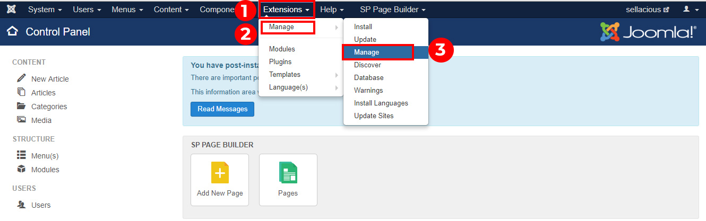
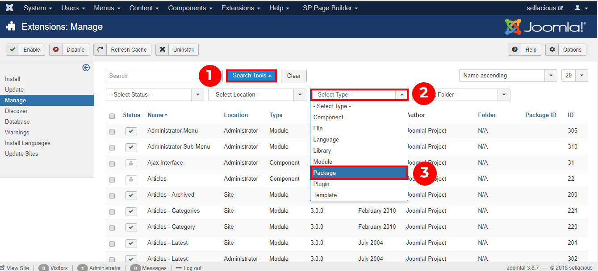
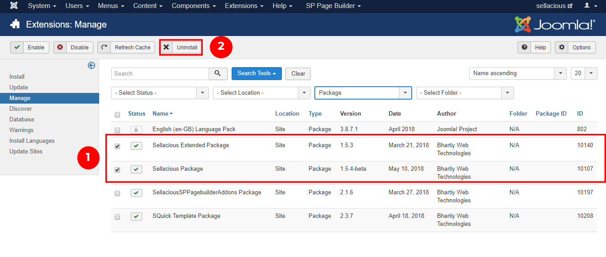

You can  uninstall the Sellacious from the joomla administrator by the following steps:

1. First of all, go to the Joomla administration panel of your website.
2. Go to Extensions and click on Manage -> Manage option from the dropped down menu.

3. Now search package type in search tools.

4. Now click on the sellacious package and sellacious Extended package.
5. Uninstall the files by using the uninstall button on the top of the window.

6. Now the sellacious is uninstalled from your website.
