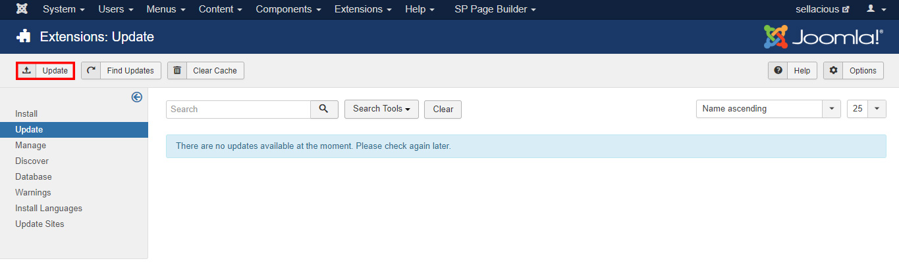

1. First of all, go to the Joomla administration panel of your website.
2. Go to Extensions and click on Manage -> update option from the dropped down menu.

3. Choose the files for update.
4. Click on the update button to update the files.

Note: Before updating ensure that the update is compatible with your Joomla! installation.
5. Now your sellacious website is updated with new version.