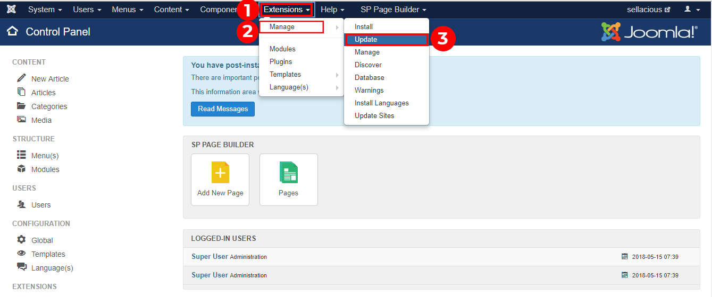
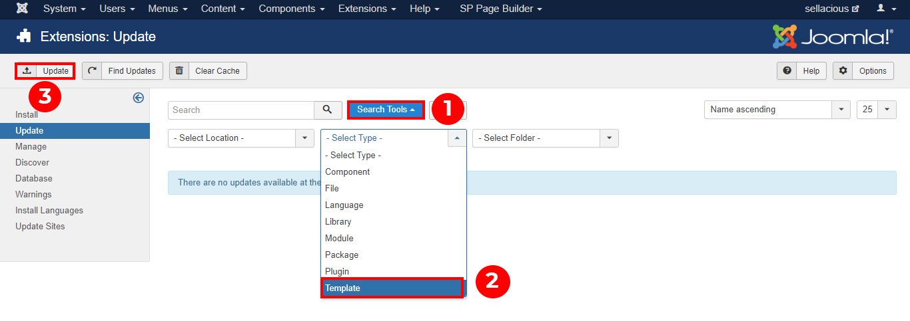

1. First of all, go to the Joomla administration panel of your website.
2. Go to Extensions and click on Manage -> update option from the dropped down menu.

3. Select Template type in search tools.The updated version will be listed here.
4. Click on the update button to update the template.

Note: Before updating ensure that the update is compatible with your Joomla! installation.
5. Now your template is updated with new version.