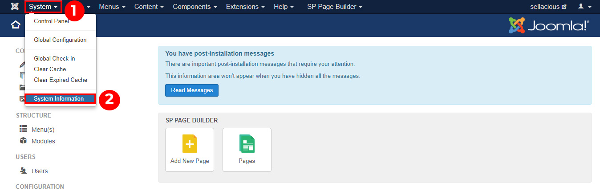

1. First of all, go to the Joomla administration panel of your website.
2. Go to System and click on System Information.

3. The system information available for System, PHP settings, Configuration file, Folder permissionsa and PHP information.
