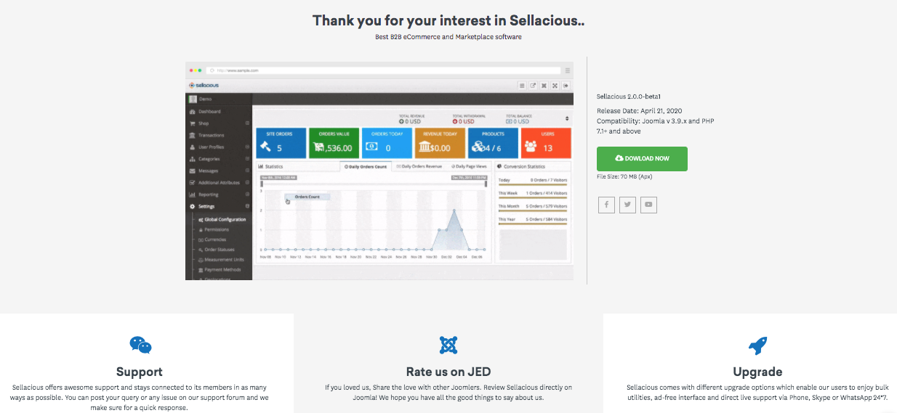
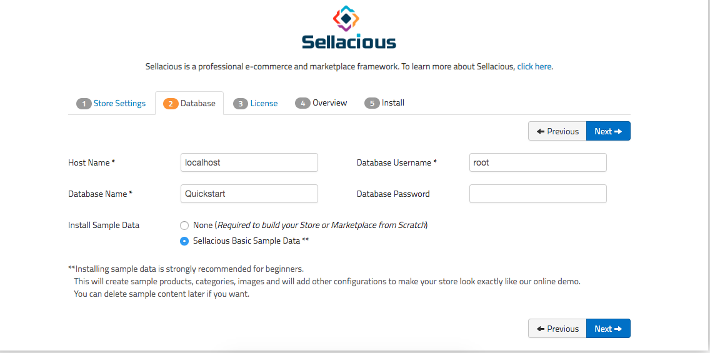

When you download Sellacious, you will find zip SQuickv2-Quickstart_v2.x.x.zip. Quickstart is an exact replica of what you see on our demo. This is for both multivendor and single vendor marketplace and configuring correctly will convert a simple single vendor marketplace to a multivendor marketplace and vice-versa. 

Quickstart is very easy to install same as the Joomla installation. The quickstart package is free and consists of sample data quickstart packages comes free with all our Free or Paid templates. The default free template "SQuick" also contain this magical file. It normally takes just 10 minutes to create a multivendor website using our quickstart.

1. Download the quickstart package from https://www.sellacious.com/download.

2. Unzip "SQuickv2-Quickstart_v2.x.x.zip" archive to the downloads folder. When installing on Localhost use http/www/htdocs folder and place the unziped folder inside htdocs, when installing on web use website root folder, mostly its named as `public html` or `www`.
3. In XAMPP, all databases bydefault are under user `root` with no password.
4. For online server, 
*  Go to cPanel > Databases > MySQL databases

*  Create new database and new user. After that, add user to the databse.

5. For local server,open your browser navigate to the folder containing the Quickstart package files(i.e. localhost/folder). For online server, navigate to your main domain or appropriate subdomain (i.e http://mydomain.com/), depending on where you have uploaded the Quickstart installation package.
6. You will be redirected to the installation page of Quickstart.
7. Fill the required fields mentioned on the Installer screen. First is store setting, enter store email and password.

8. Second is database, enter the database name with root user (for local server). If you install it on live, enter that database name, username and password that you created in step4(cPanel).

9. In third license step, choose your subscription plan and activate that plan (use licence key if already baught plan)and click on next.

10. Fourth is overview step, In which store setting and databse configurations are showing.

11. Final last one is installing step. After successfull installation, please remove the installation folder by clicking the option.  
12. You can login to the Joomla administrator panel by www.domain.com/administrator.

13. You can login to the Sellacious administrator panel by www.domain.com/sellacious

