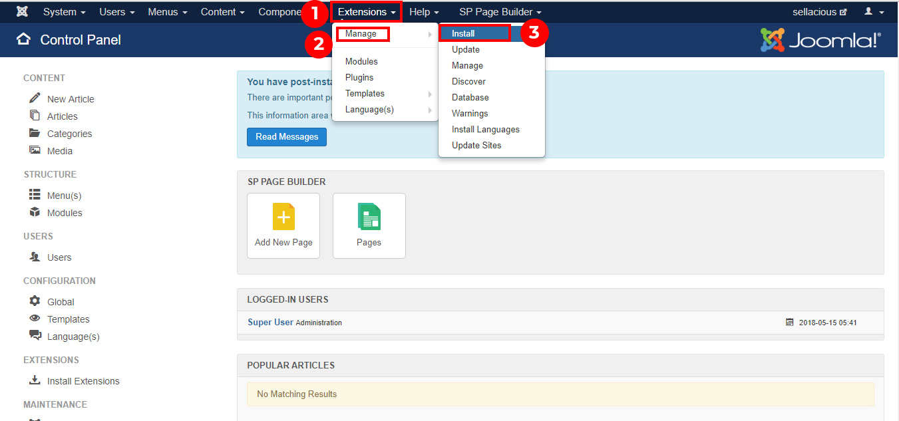
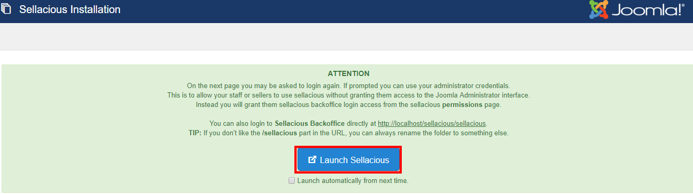
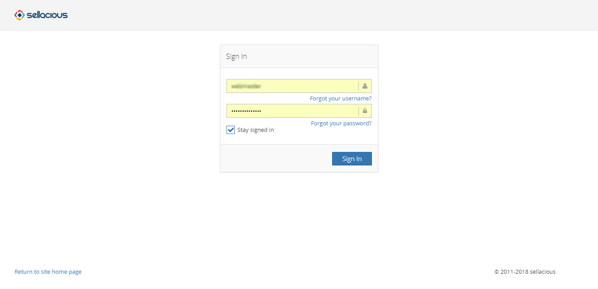

There are two ways to install from joomla bakend
1. Install via Web
2. Install by upload
3. 
**Install via Web:** follow these steps when installing from web
1. First of all, go to the Joomla administration panel of your website.
2. Go to Extensions and click on Manage -> Install option from the dropped down menu.

3. Now click on Install From Web tab in Extensions: Install section.
4. Search for Sellacious in the search box. After search results appear, click on the first one i.e. Sellacious.

5. After that, click on Install button to start the installation process. Once core package is installed it will install additional libraries. Let it install it may take few minutes.

7. Click on Download & Install Now button to install the Sellacious additional libraries.

7. Once the processing ends, go to Components and click on Sellacious from the dropped down menu.

8. After the processing is done, Launch Sellacious.

9. Login to your Sellacious panel by using your Joomla credentials, Sellacious is ready to use.

**Install by upload:** follow thsese steps when installing by upload

1. First of all, go to the Joomla administration panel of your website.
2. Go to Extensions and click on Manage -> Install option from the dropped down menu.

3. Now click on Upload Package File tab in Extensions.
4. Click on Browse File and select the downloaded (core+extended) package.

6.Click on Download & Install Now button to install the Sellacious additional libraries.

7.Once the processing ends, go to Components and click on Sellacious from the dropped down menu.

8. After the processing is done, Launch Sellacious.

9. Login to your Sellacious panel by using your Joomla credentials, Sellacious is ready to use.

10. You can also access this backoffice using www.yourwebsite.com/sellacious You can also rename /sellacious to /backoffice etc by renaming the folder. 
