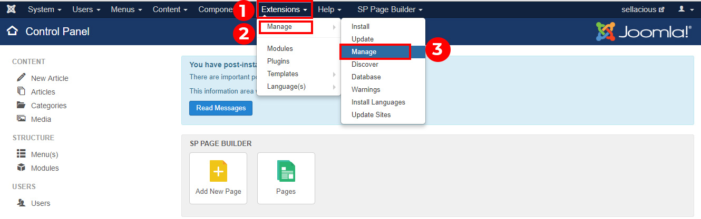
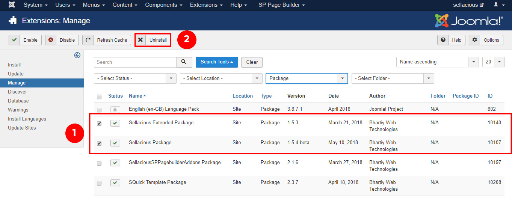

You can  uninstall the Sellacious from the joomla administrator by the following steps:

1. Go to the Joomla administration panel of your website.  www.yourwebsite.com/administrator 
2. On top menu of Joomla administrator Click on Extensions and click on Manage -> Manage option from the dropped down menu.

3. Now search package type in search tools.

4. Click on the sellacious package and sellacious Extended package.
5. Uninstall the files by using the uninstall button on the top of the window.

6. You will see a success message in couple of seconds. 
7. Sellacious is now successfully uninstalled from your website.
