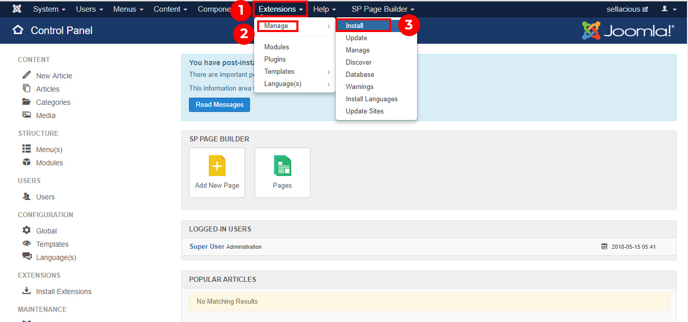
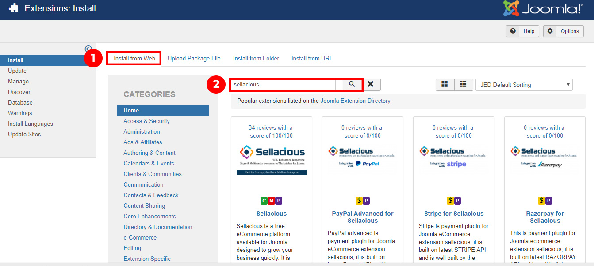
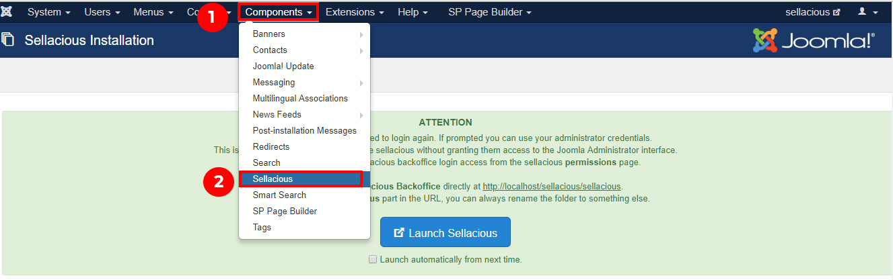
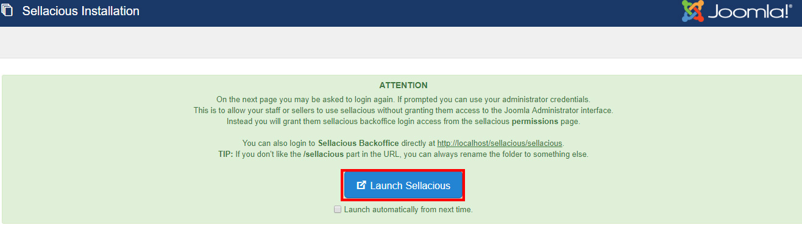
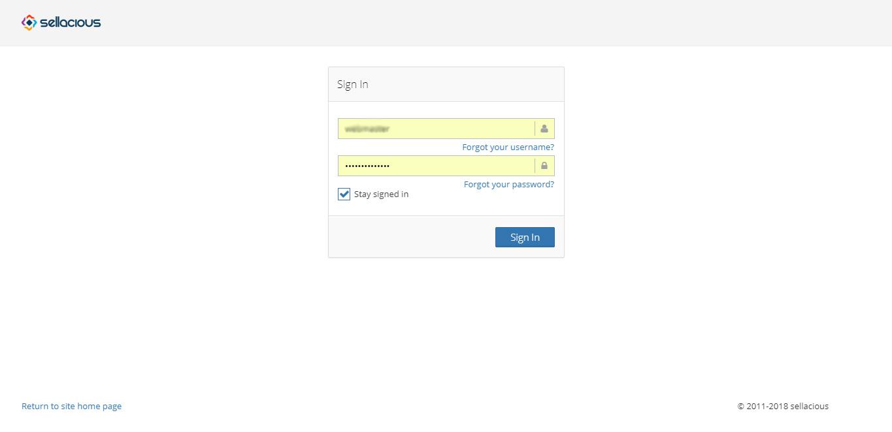
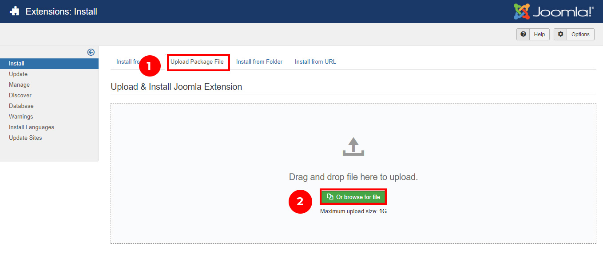

Sellacious can be installed on Joomla by using ['Install by upoading'](https://sellacious.com/learn/basics/installation#you-can-install-the-sellacious-by-install-by-upload) or using 'Install via web' option.

'Install via Web' is most probably the easiest way of installing Sellacious.
1. First of all, go to the Joomla administration panel of your website.
2. Go to Extensions and click on Manage -> Install option from the dropped down menu.!

3. Now click on Install From Web tab in Extensions: Install section.
4. Search for Sellacious in the search box. After search results appear, click on the first one i.e. Sellacious.

5. After that, click on Install button to start the installation process.
6. Click on Download & Install Now button to install the Sellacious additional libraries.

7. Once the processing ends, go to Components and click on Sellacious from the dropped down menu.

8. After the processing is done, Launch Sellacious.

9. Login to your Sellacious panel by using your Joomla credentials, Sellacious is ready to use.

### You can install the sellacious by 'Install by upload'.
1. First of all, go to the Joomla administration panel of your website.
2. Go to Extensions and click on Manage -> Install option from the dropped down menu.

3. Now click on Upload Package File tab in Extensions.
4. Click on Browse File and select the downloaded package.

6.Click on Download & Install Now button to install the Sellacious additional libraries.

7.Once the processing ends, go to Components and click on Sellacious from the dropped down menu.

8. After the processing is done, Launch Sellacious.

9. Login to your Sellacious panel by using your Joomla credentials, Sellacious is ready to use.

10. You can also access this backoffice using www.yourwebsite.com/sellacious You can also rename /sellacious to /backoffice etc by renaming the folder. 
