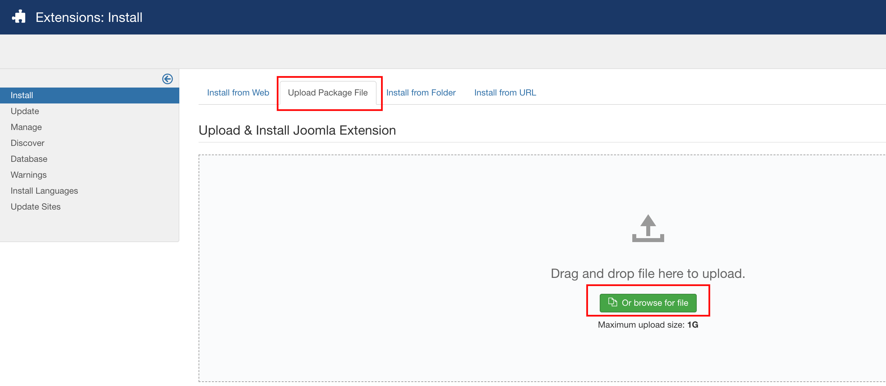

**Very Important:** 
Kindly Take backup of your website and databse before updating it. 
It's preferred not to upgrade live site and upgrade it over staging first, test it and then move it to live.
There are two ways to update Sellacious on your site.
1. Manual Update
2. From Joomla

**1. To update sellacious manually, follow below steps:**
1. Go to https://www.sellacious.com/p/core/sellacious and download core and extended package of latest version of sellacious.

2. Go to Yoursite.com/administrator. 
3. Proceed to Extensions -> Manage -> Install.
4. Select tab 'upload from package' and click on browse for file.

5. Select the file with the name like `pkg_sellacious_v2.0.0-beta3.zip` (_version can varied_). This is the core package of sellacious.
**Note: It's mamdatory that you install the core package of sellacious first(not extended).**

7. Once the core package of sellacious first, you'll get the msg to Downlaod and Install automatically. You can either click on that button to complete the update of sellacious or  click on **stop button** and manully install the extended package of sellacious `pkg_sellacious_extended_v2.0.0-beta3.zip` (_version can varied_).
**While updating manually it is reccomended that you click on stop button and install extended package similarly.**

**Note: Installation of this package after Core is very important to fetch all the important updates of sellacious. If you don't install this package of sellacious, you'll face the issue with your sellacious.**

8. After updating extended package you will be redirected to this page which means sellacious is updated successfully. 

---

**2. To Update from  Joomla, follow the steps:**

1. Go to the Joomla administration panel of your website.
2. Go to Extensions and click on Manage.
3. Select update option from the dropped down menu.

4. On the top there will be a button of **Find Update**.
5. Click on it, and it will find the available updates of sellacious.
6. When the updates are found.
7. Select the file you want to update.
8. And Click on the update button, present at the top to update the files

**Note: Before updating ensure that the update is compatible with your Joomla! installation.**
9. Now your sellacious website is updated with new version.