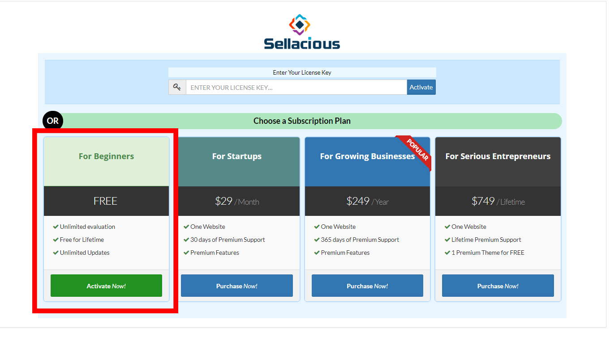

**Once installed, Sellacious must be activated so that Sellacious can use many of its API.** 
**As soon as Sellacious is installed and launched, It asks for an active subscription. Subscription is a simple Email submit process.**

**1.** After installing Sellacious, go to your Sellacious administration panel.
**2.** Once you log in to the panel, You can choose the subscription plan. There are four subscription to activate the sellacious. For beginners subscription plan is free and other subscription plan can be considered as the preimum plans.

**3.** If you want to use free license then Purchase 'For Beginners'.
**4.** Complete the registration followed by verification.For verification, you will receieve an email to verify the code.
**5.** Complete the initial configuration of about store, shop settings and Premium Trial.

**6.** You will get an email regarding the license key.This can be used directly to activate your account.

**7.** Now your free license is activated, you can check it in your Sellacious panel.
