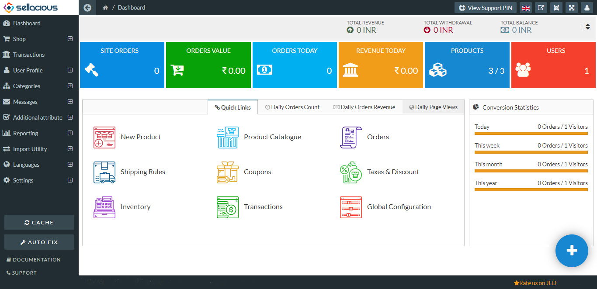

The dashboard is an information management tool to track multiple data sources because it provides a central location for business to monitor and analyze performance.
From here you can analyze the growth of your site. Sellacious gives you many options to probe your site, which are as follows: 

**Total Revenue:**  Total revenue is represented as the amount of money by adding and withdrawing the fund from the seller’s account. We can add and withdraw the fund in the transactions section of sellacious panel through the direct deposit and payment methods. Total revenue is the total receipts of a seller obtained from selling goods or service to buyers.

**Total withdrawal**:  Total withdrawal is the amount of money you withdraw from your account. You can withdraw the money by clicking on the place withdraw button in transactions section of sellacious panel. Withdrawal is removing the funds from your account. You can withdraw the money from the transactions section in the sellacious panel.

**Total Balance**:  The total amount of money in your account. Total balance is  the current balance of your account. It also represented as the account balance. You can add the fund or withdraw the fund from the Transactions in sellacious panel.

**Site orders**: The total number of orders placed and processed on your website. This value consists the orders of following order statuses: Order Placed, Payment Pending Approval, The Payment Approved, Packaged, Waiting for pickup, Shipped, Delivered, Returned, Exchanged, Payment failed, Order placed and cancelled.

**Orders value**: This value represents only the orders of the present day. This value consists the orders of the following stOtuses: Order Placed, Payment Pending Approval, The Payment Approved, Packaged, Waiting for pickup, Shipped, Delivered, Returned, Exchanged, Payment failed, Order placed and Cancelled. 

**Orders today**: The number of orders which are placed on a particular day. The value will be shown according to the orders placed for a particular day. The orders today is calculated only when the number of the products are to be bought from the front end.

**Revenue Today**: The revenue will be calculated according to the daily basis. The value will be shown in the revenue today section in the dashboard of the sellacious. The Revenue today section will represent the amount of money we got by selling the product.

**Products**: In this section, you'll know about the number of total products/ the number of total products with their variants. This content shows the total products on your website except for unpublished, trashed, expired products. 

**Users**: The number of the users whose profile is currently active on your website.

**Quick links**

Quick links provide to direct access for creating the Products Shipping Rules Coupons etc. The quick link is a list of unstructured links placed in a prominent place on a page. It helps the quick access for accessing the sellacious backend.
 **First/new product:**
This Quick link helps you to create your first/new product with direct access.Click on the new product (plus icon) to create your first/new product.This is the link where you can know how to create a product. (add link to the documentation page of product creation)
 **Direct access to product catalogue:** 
This link is the direct access to the product catalog (list view of the products created on your site). From here you can manage product statuses in bulk. For more information click here.
 **Direct access to orders:**
This quick link is the direct access to the orders page of your site. From here you can manage the orders of your site. You can edit statuses, track the orders. To know more about this feature of sellacious, please click here.
 **First/new shipping rule**
This quick link is the quick access to the creation of the new/first shipping rule. From here you can create a shipping rule. There are many options to configure the shipping rule. You can create them for an entire shop or for particular users/products/sellers. This is the link to know about these rules more in details. 	
**First/new coupon**
This link is the direct access to the coupon. From here you can create your first/new coupon. You can create a coupon from here for the site, seller. There are many filters to apply on the coupon. You can create a coupon for the particular product, user category, seller category, geo-location. To know more about coupons, please click here. 
 **First/new shop rules(taxes/discounts):**
This link is the direct access to the shop rules (taxes & discounts). You can create your own first/new shop rule from here. Similar to shipping rules and coupons, shop rule also has many filters. 
You can create an offer for a particular product or product category or user category. To know more about this feature of sellacious, please click here. 

**Daily orders count:** This statistics at dashboard represents the number of orders on a particular day. These statistics are in the form of line graph. These number of orders are for one month. (i.e: for example, 11 April 2018 to 11 May 2018).

**Daily orders Revenue:** This statistics at the dashboard represents the revenue collected through the orders on daily basis. This revenue is in the shop currency. This information is in the line graph. (i.e: for example, 11 April 2018 to 11 May 2018).

**Daily pageviews:** This statistics on the dashboard will show the number of the visitors to the site. These statistics calculate for the daily basis and represents in the line graph. (i.e: for example, 11 April 2018 to 11 May 2018).

**Conversion statistics**
Conversion Statistics shows the orders and visitors according to the current day, week, month and year in a proportion of orders by visitors. 
Today  In this row,The statistics were  shown according to the current day with the proportion of number of orders by number of visitors.
 **This week:**  In this row, The statistics were shown according to a current week  with the proportion of number of orders by number of visitors.
 **This month**: In this row, the statistics were shown according to a current month  with the proportion of number of orders by number of visitors.
 **This year**: In this row , the statistics were  shown according  to a current year  with the proportion of number of orders by number of visitors.

**Note**: The blue plus icon on the right bottom side: Direct access to create a product easily.

