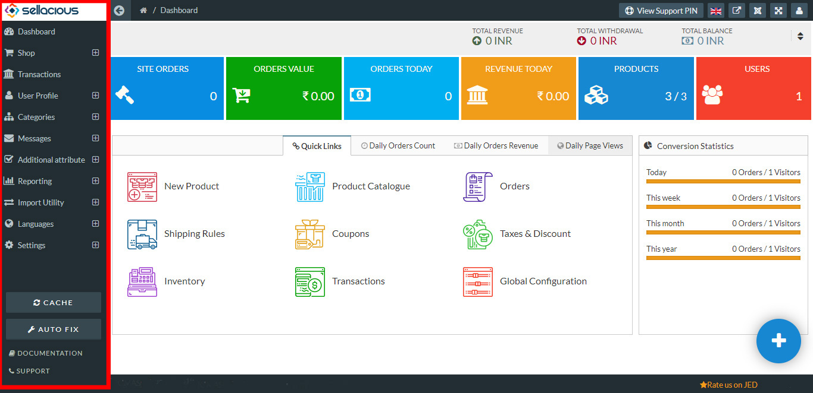

**Dashboard:** The dashboard is an information management tool to track multiple data sources because it provides a central location for business to monitor and analyze performance.From here you can analyze the growth of your site.

**Shop:** The shop is the place where you can get the details of all the created products. Here you can create the products in your shop by using the product catalogue. Sellacious is having vast inventory manager to manage the stock. You can add the Taxes and discount for the products created and you can create new taxes and discount rules. Shipping rules can be added to the product while shipping the product. You can apply the coupon code for each product with the coupon menu in the shop. Then orders menu will help you to find the placed orders from your website. Review and rating menu will help you to list the review and ratings of the products.

**Transactions:** Transaction is an agreement or communication carried out between a buyer and a seller to exchange an asset for payment.It involves a change in the status of the finances of two or more businesses or individuals.

**User Profile:** User profile is the section in which we can create the user in sellacious. The users include  all users, manufacturers, sellers, clients and staffs. You can create the user profile for this users in sellacious.

**Categories:** You can handle the products according to the category. In categories include the special categories, All categories, Physical product, Electronic product, client, staff, seller and manufacturer. Special categories is the product listing according to the highlighted, bordered and featured. All categories is the combination of all the categories which is represented as in hierarchical order. Physical product are the products which are physically present like Laptops,phone etc.Electronic Product are the products which are based on online(i.e. e-books, coupon).Client is a person who is using the services by logged into website.Seller is the person who sells the product. Manufacturer is the person who make goods for sale.Staff is the person who is providing the technical support.

**Messaages:** Messages section is for internal messaging only. You can send the bulk messages to client, seller, manufacturer and  as well as for everybody. For messaging, the email id of the registered user will be already registered.

**Additional Attribute:** Additional attribute is mainly used for adding additional attribute to your fields.If you want to add cutom fields then this additional attribute menu will be helpful.

**Reporting:** This section will report all the downloads and emails done in the sellacious software.You can check all the emails and downloads information from the backsite of the sellacious. Communication log will help you to list all the email transactions done within the sellacious. Product queries will list all the queries regarding the products, which is sented by the user from the front end of the sellacious. Sellacious Backsite menu will be listed three kinds of downloads: All downloads, File wise Downloads, and product downloads. All these downloads are listed here.

**Settings:** Settings is the main part of the sellacious Backsite.The settings inlcude menu manager, Global configuration and many more options to set your shop.You can set the settings for the following points. Menu manager will create and manage the menus in the sellacious backsite and system preset. Global configuration is the back bone of the sellacious backsite from where you can control the activities in the sellaicous frontend and backsite.Permissions menu will help you to give permission for the users.The users can be guest,sellers,staffs,admin and registered user.Currencies can be included in your shop.The current status of the orders can be setted from the status section.The measurement units include the units of the measurement.You can create the measurements for your shop.Geolocation is the identification or estimation of the real-world geographic location of an object, such as a radar source, mobile phone, or internet-connected computer terminal.Email Templates represents the active Templates. We can create the email templates for sending the mails from here.License is an official permission which is provided by the owner.

 
