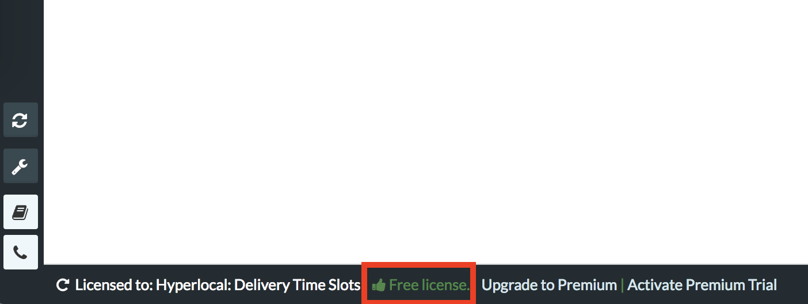
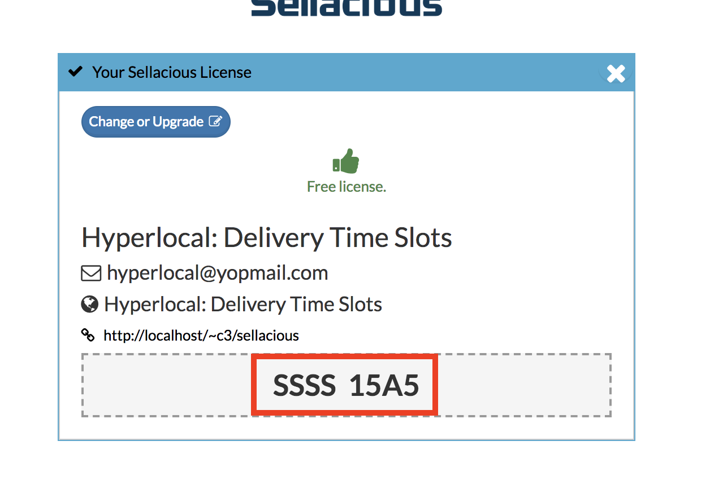
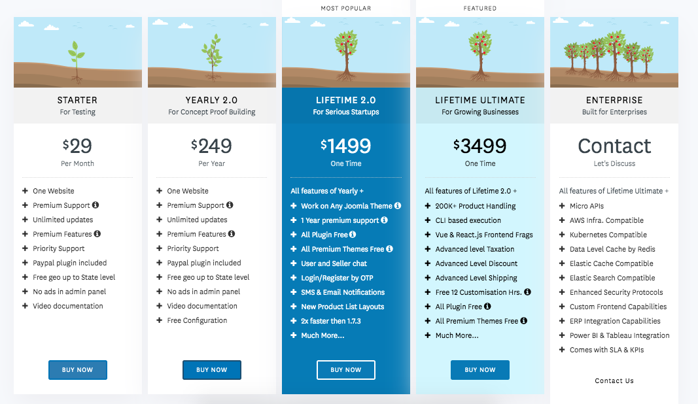
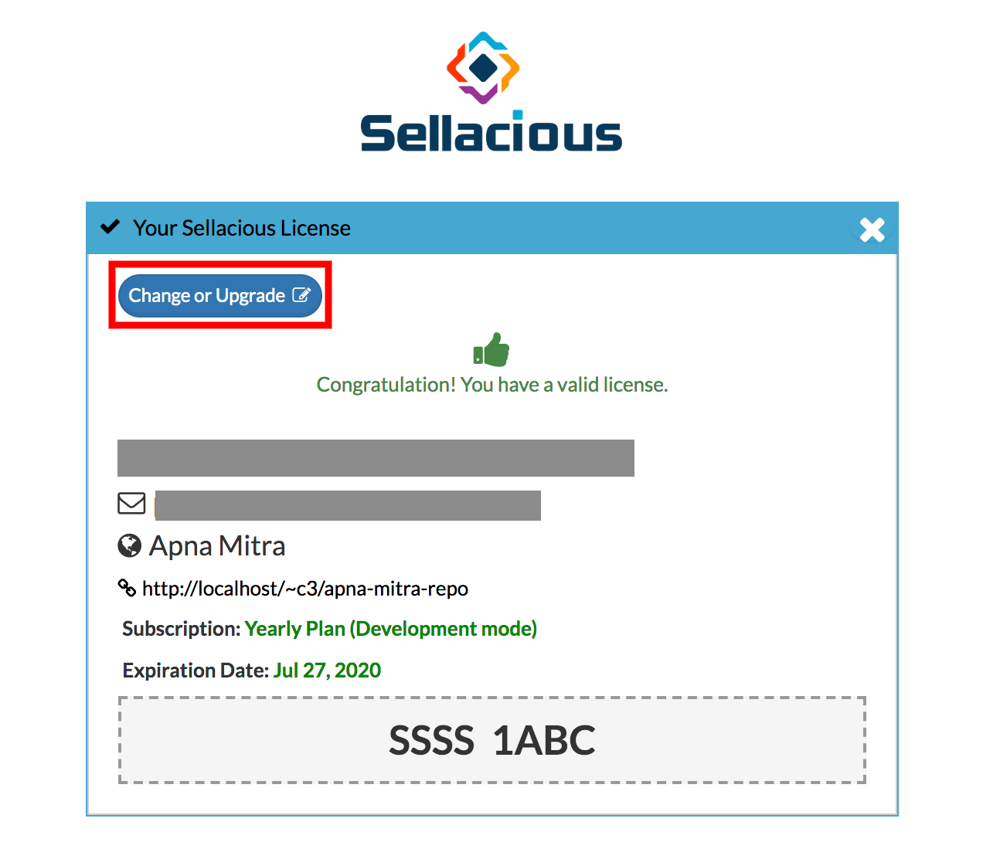
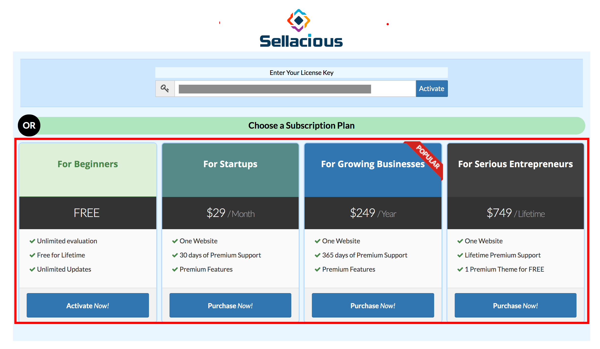

There are two ways to upgrade a free license to premium license.
1. When you have already installed free license: go to method 1.
2. When you have not purchased a premium license: go to method 2.

## **1. From sellacious.com (Site Key):**

This method is for when you have already installed free version and now purchased a premium license with same/different email id.  

 **Step1:** Now go to the sellacious backend of your site. At the bottom of the dashboard page, click on the free license green text, which will redirect you to the license information page.  

**Step2 :** At the bottom of the page is your Site Key. Copy that site-id.

**Step 3:** Go to your sellecious.com account > dashboard > subscription. In premium subscription, you'll see the license you have purchased.  

**Step 4:** Paste your site-id in to the site-id field and save.

**Step 5:** The license is upgraded from free to premium. Go to your sellacious backednd and reload your page and click on the license information, it will your upgraded license details.

## **2. From sellacious backend:**

To upgrade your site from free to premium, you need to purchase the premium license from here https://www.sellacious.com/pricing

To do this go to the sellacious backend of your site and click on the license information. A window will open which will show the license information.  

Click on 'Change or Upgrade' and licenses available on sellacious will open.

Select the license you want to activate, click on it and purchase the license. Or, If you purchase any other other license from sellacious.com/pricing , enter your license key on the above screen and activate it.

The premium license is activated now on previous license key.

_**Note: Site Key is unique for every Site.**_

>> If you're getting a msg **Your license has expired. You can renew again for FREE!**, please click on this msg and register for free license (if you have purchased the premium license already) or Premium license if you want to use sellacious with premium feature and awesome support.