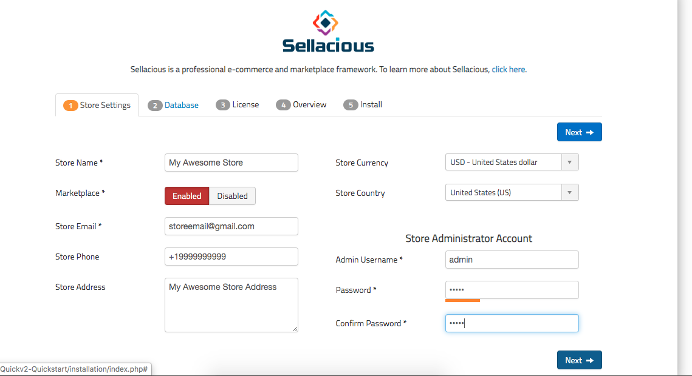
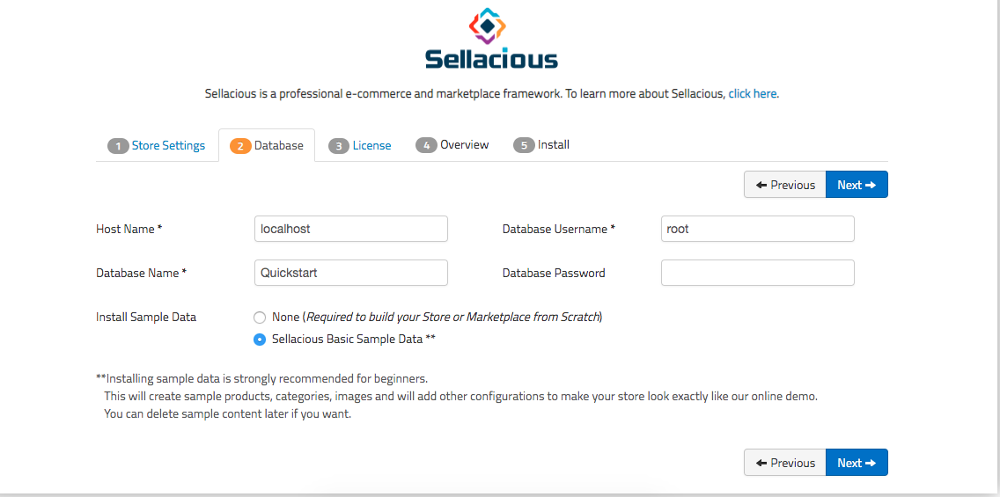
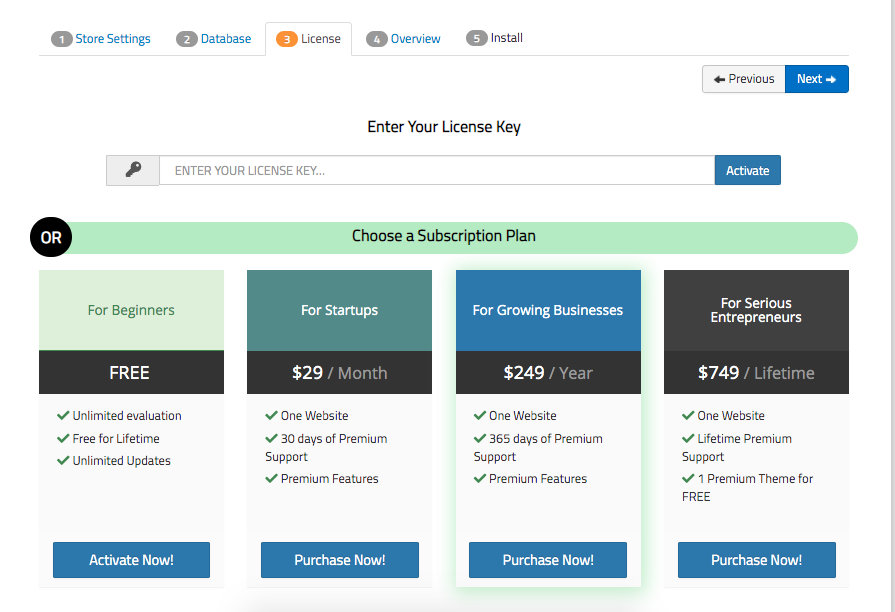
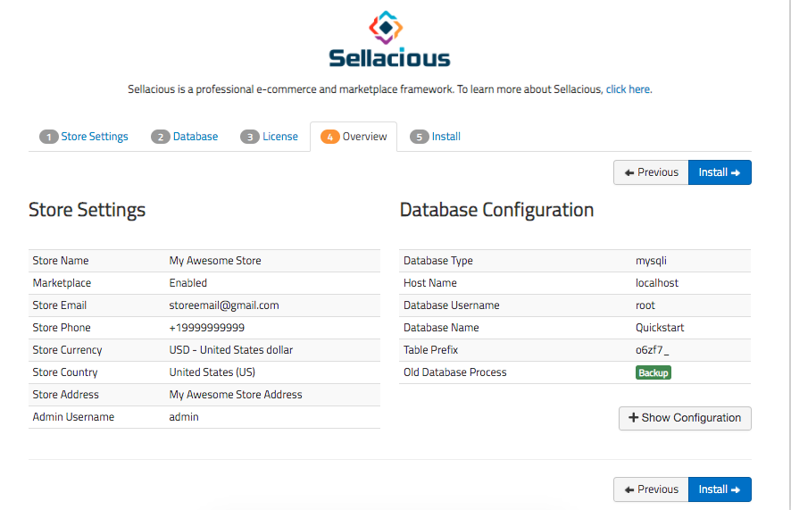

There are two ways to upgrade a free license to premium license.
1. When you have already installed free license: go to method 1.
2. When you installing it for first time: go to method 2.

## **1. From sellacious.com (Using Site Id):**

This method is for when you have already installed free version and now purchased a premium license with same/different email id.  

**Step 1:** Now go to the sellacious backend of your site. At the bottom of the dashboard page, click on the free license green text, which will redirect you to the license information page.  

**Step 2:** At the bottom of the page is your Site Id. Copy that site-id by clicking on it.

**Step 3:** Go to your sellecious.com account > dashboard > subscription. In premium subscription, you'll see the license you have purchased.  

**Step 4:** Paste your site-id in to the site-id field and save.

**Step 5:** The license is upgraded from free to premium. Go to your sellacious backednd and reload your page and click on the license information, it will show your upgraded license details.

_**Note: Site Key is unique for every Site.**_

## **2. Activate during installation:**

**Step 1:** When you installing it for first time, enter the store setting in first step.

You can also refer to this for installation: https://www.sellacious.com/documentation-v2#/learn/installuninstall/quickstart-installation

**Step 2:** Enter the database name accordingly with username and password.

**Step 3:** Enter your license key and activate it. Licence key is sent to your email at the time of purchase of plan. If you do not have licence key choose free and complete installation. After that follow first method to activate premium.

If you activate free license, you will get email verification link on your mail-id.

You can also buy a licence at this step (if not already) select the license you want to activate and it'll redirect you to the sellaicous.com with the selected license in your cart. Complete the payment process and purchase the license. Now, it'll redirect you back to your site with the activated license.

**Step 4:** In fourth step, you will get overview of store setting and databse configuration. Click on install button and install it.

The premium license is activated now on previous license key.

>> If you're getting a msg **Your license has expired. You can renew again for FREE!**, please click on this msg and register for free license (if you have purchased the premium license already) or Premium license if you want to use sellacious with premium feature and awesome support.