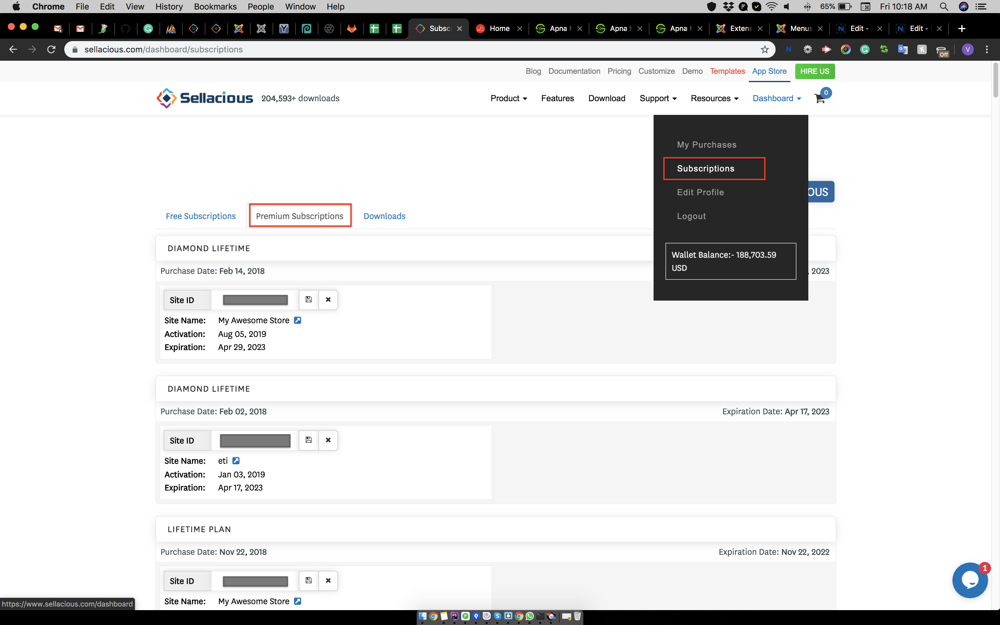

There are two ways to upgrade a free license to premium license.

## **1. From sellacious backend:**

To upgrade your site from free to premium, you need to purchase the premium license.  

To do this go to the sellacious backend of your site and click on the license information. A window will open which will show the license information.  

Click on 'Change or Upgrade' and licenses available on sellacious will open.

Select the license you want to activate, click on it and purchase the license.  

The premium license is activated now on previous license key.

## **2. From sellacious.com (Site Key):**

This method is for when you have already purchased a premium license with same/different email id.  

After purchasing the premium license, go to Dashboard > Subscription. In premium subscription, you'll see the license you purchased.  

Now go to the sellacious backend of your site. Click on the license information, which will redirect you to the license information page.  

There at the bottom is the Site Key. Copy that site key. Paste it into your sellacious.com account > premium subscription.  

The license is upgraded from free to premium.

_**Note: Site Key is unique for every Site.**_

>> If you're getting a msg **Your license has expired. You can renew again for FREE!**, please click on this msg and register for free license (if you have purchased the premium license already) or Premium license if you want to use sellacious with premium feature and awesome support.