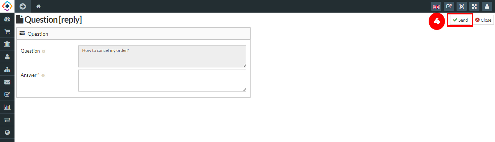

Ask a question feature presented on the sellacious admin panel in which User can ask question on regarding the product which can be answered.User can ask the questions from the frontend.
1. Go to the product page in the frontend.
2. Ask a question section will be presented on the product page.
3. You have to add the name, email id along with your question.
4. Click on the submit button.

5. Go to the sellacious admin panel. All the questions are to listed on the shop-> Product queries.
6. For adding products to your inventory, go to Shop and select Product Questions from the dropped down menu.
7. Click on the questions, Now write the reply for the product question.

8. Click on the send button to send the questions.

