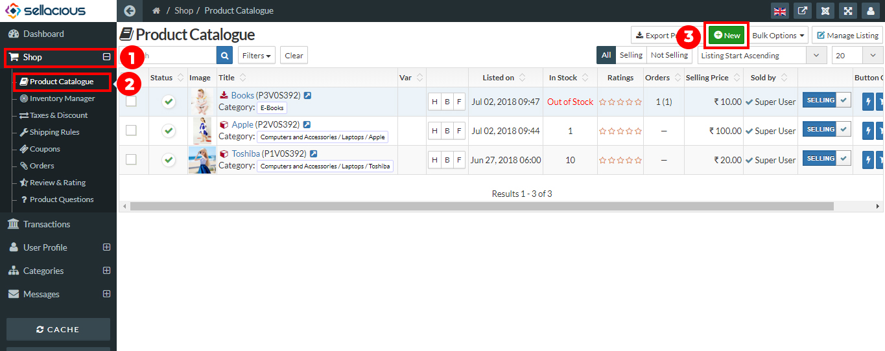
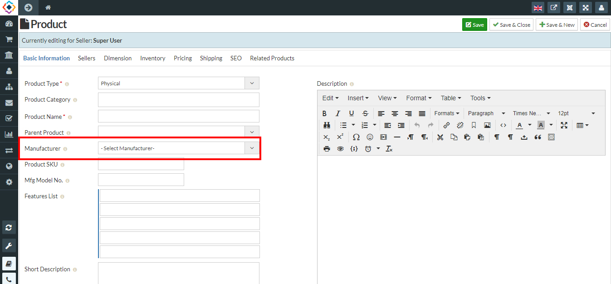

#### ### ## ### ###### # **User can mention manufacturer details in Manufacturer column.**

**By Default sellacious provide Manufacturer column, but the user have to enable it.**
To enable Manufacturer column:
1. Go to the Sellacious panel of your website.
2. Go to settings menu at the left menu bar and select global configuration from the drop down           
    Menu.
3. In the extension’s setting, go to Frontend display options.
4. At the bottom, there will be an option of Backend Display Option.
5. Edit the fields, check manufacturer in all columns.
6. Save the changes you made.

And In Creating any product it shows an option for manufacturer.

**Now You can create manufacturer or brand by the following steps:**
1. Go to the Sellacious panel of your website.
2. For creating brand/Manufacturer to your inventory, go to Shop and select Product Catalogue 
    from the dropped down menu.
3. Click on the new button, Then on the basic information tab go to the manufacturer menu.

4. Select the manufacturer, If the manufacturer is not listed then create a manufacturer from the 
    category section.
    

5. Save the details by using the save button.

You can mention Brand and Manufacturer name in Manufacturer option. But if you want to make a different column for Brand, create a new column Brand From Additional Attribute.

