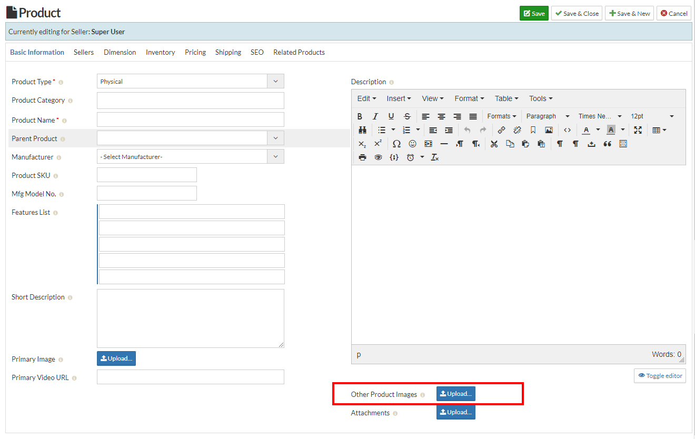

1. Go to the sellacious admin panel.
2. For Bulk image upload, Go to the shop then select the Product catalogue from the drop down bar.

3. Click on the new button to create new product, after saving the product once.
4. Click on the images to upload in bulk on the basic information tab.

5. Save the details of the product by clicking on the save button.