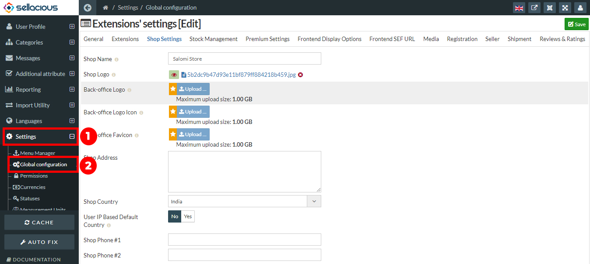
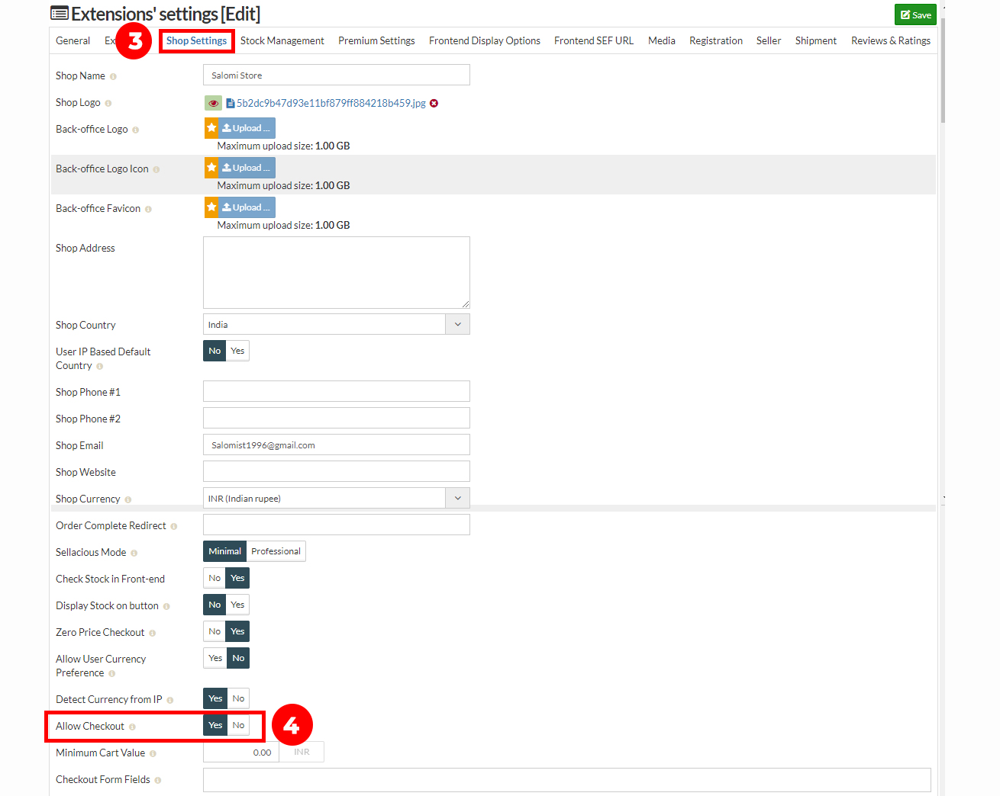

1. Go to the Sellacious panel of your website.
2. For disabling Checkout, go to Settings and select global configuration from the dropped down menu.

3. Go to the shop settings tab, then on the allow checkout mark is as "No".
4. Now your checkout is disabled. Now, The User will not be able to allow or checkout the orders.

