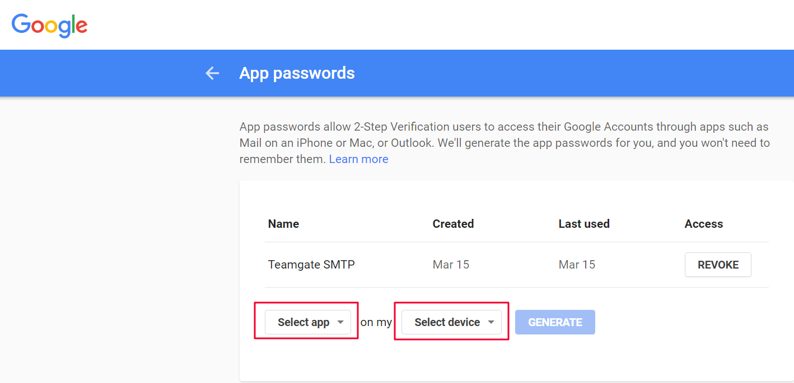
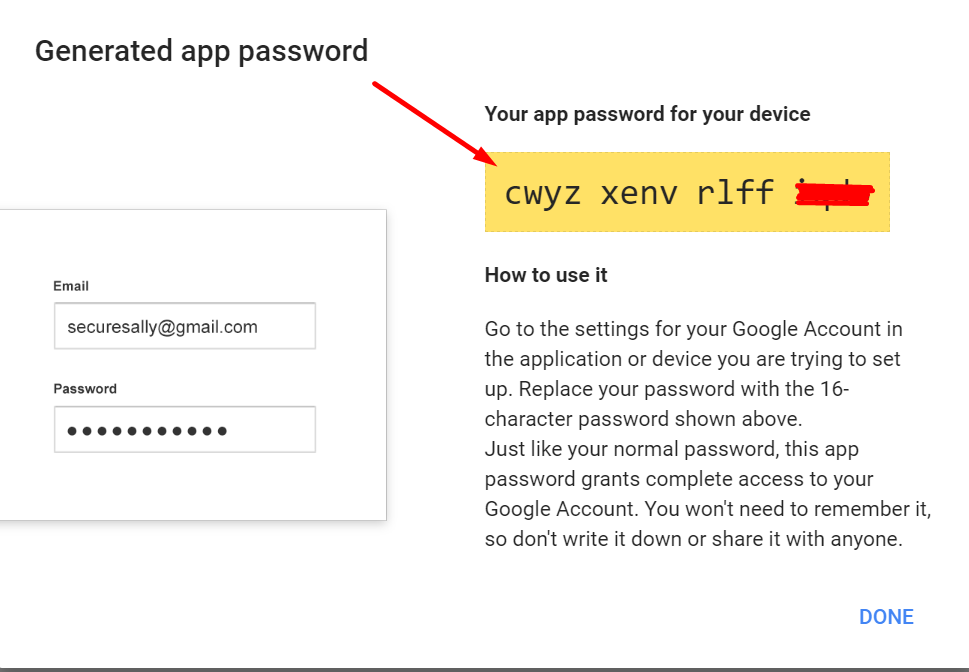
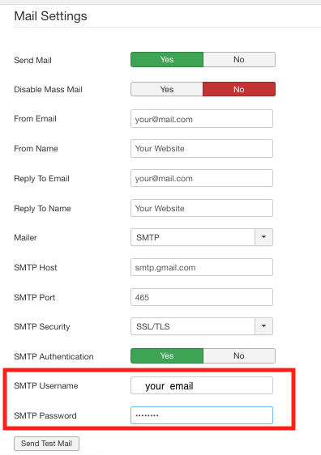

**Written by:** Indresh Maurya
**Date:** 23-08-2019

If you are using 2-step password verification in Gmail- you need to generate the new password. After generating the password- follow all the steps-

1. Connect to your Google account. Click on the top right corner and click "My account".

2. Click Security and App passwords

3. Enter the password of your Gmail account > continue.

4. Click Select app > select "Other (Custom name) > enter Teamgate and click > GENERATE

5. Copy your app password for your device (from the yellow field)

6. Enter the password (without space) into SMTP password field.

Note: For yoahho mail go to https://help.yahoo.com/kb/generate-third-party-passwords-sln15241.html
