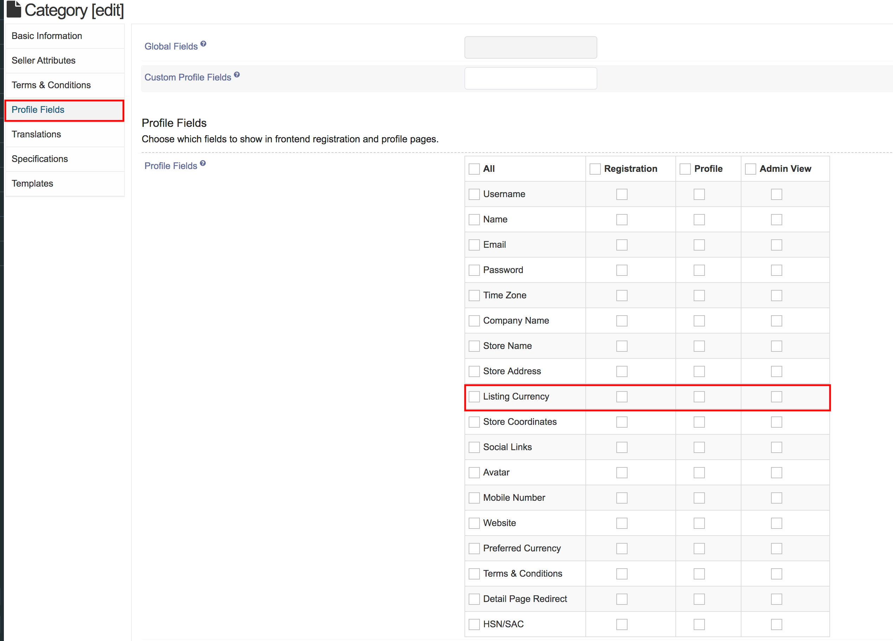
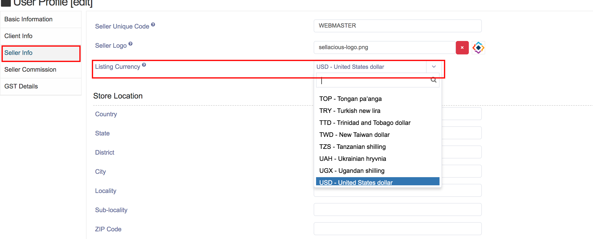

**Written By**: Rashi Gupta
**Date**: 08-06-2020
**Compatibility**: Sellacious v2.0.0-Beta1+

To change the currency of seller, follow these steps:

1. From the left menu, Go to the **Settings->Global configuration->Seller** and found Listing Currency (Multi Currency).
2. Save the settings.
3. Go to the seller category from left menu, **Categories->Seller**.
4. In the Profile fields tab check the listing currency.
5. Save seller categories changes.
6. Now go to the seller profile from left menu, **Use rProfile->Sellers**.
7. In the seller info tab, you can found Listing currency tab.
8. You can change the currency accordingly.