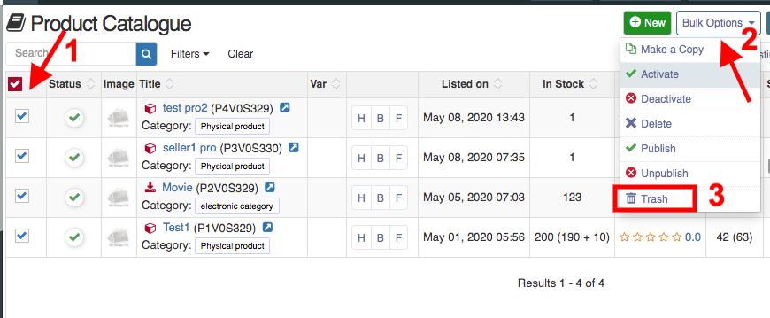
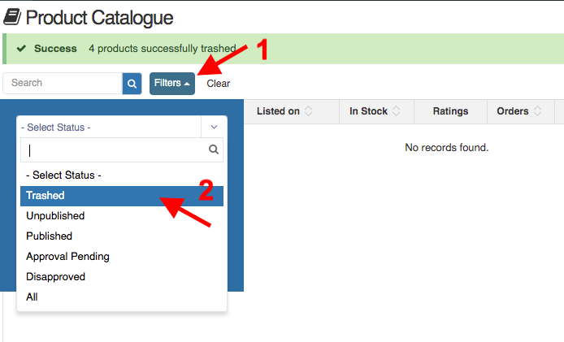
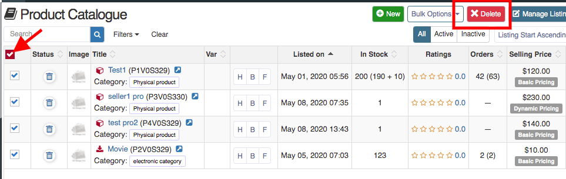
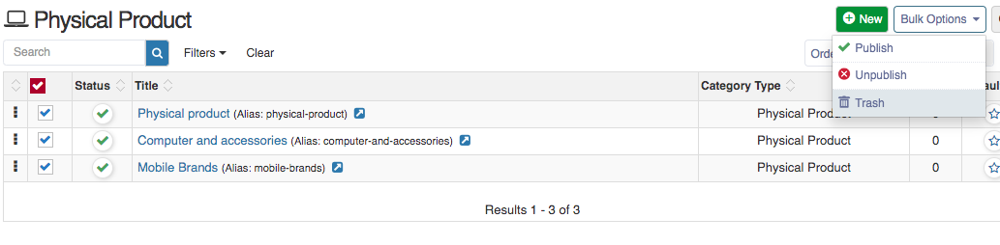
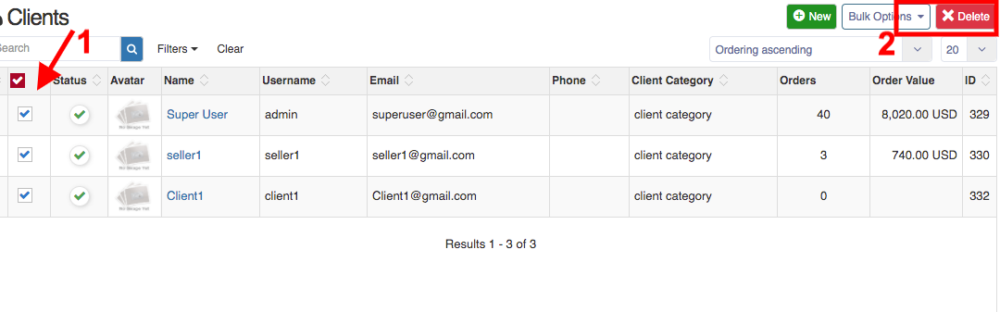
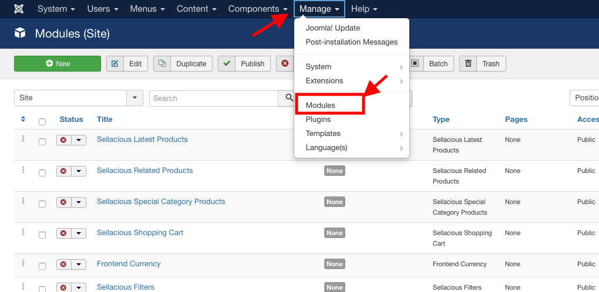
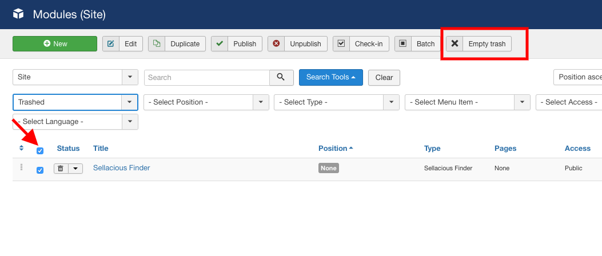

To remove the sample data, we need to remove all products, categories, users one by one. 

**1.Remove Products -** To remove all products in once, select all products then click on the bulk options button and trash all the products. 

After trashing the products, click on filters and select trashed inside select status. 

Again select all products and click on delete button. You will get message for successfully deleted products. 

**2.Remove Categories -** To remove all categories at once, go to product categories and repeat all the same steps as we have mention in products.

**3.Remove Users -** To remove users, go to user profile and select all users you want to remove and click on delete button.

**4.Remove Modules -** To remove modules go to the joomla admin. Open the modules from the menu, go to the Manage >> Modules 

Select the modules you want to delete and click on trash button. After trashing the modules, click on search tools and select status Trashed and click on Empty Trash button to remove modules.

