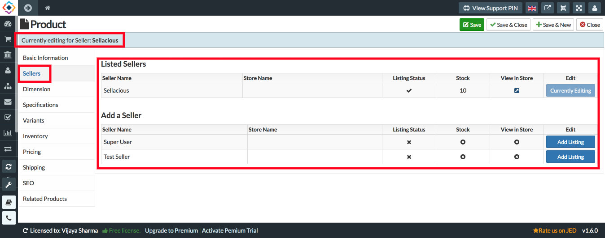

You can always add or edit the listing of seller in product. This tab will be visible only for admin. Sellers can't view this tab unless they have the permission to view this tab.

**Currently Editing:** Whenever you create;edit a product, you can view the seller name for which you're editing/creating the product at top.

**Listed Seller:** In this section you can view the seller for which the product is already created. This section is only visible when you save the new product or edit already created product. You can always click on switch to edit the product for another seller. 

**Add a Seller:** In this section you can view the seller for which product is not created. You can simply add a seller to the product by clicking _Add Listing_.

**Listing Status:** This column show you the status (Active/Inactive) of product for the sellers.

**Stock:** You can view available stock of the product for the sellers.

**View In Store:** With this you can directly open the product for the particular seller on frontend.