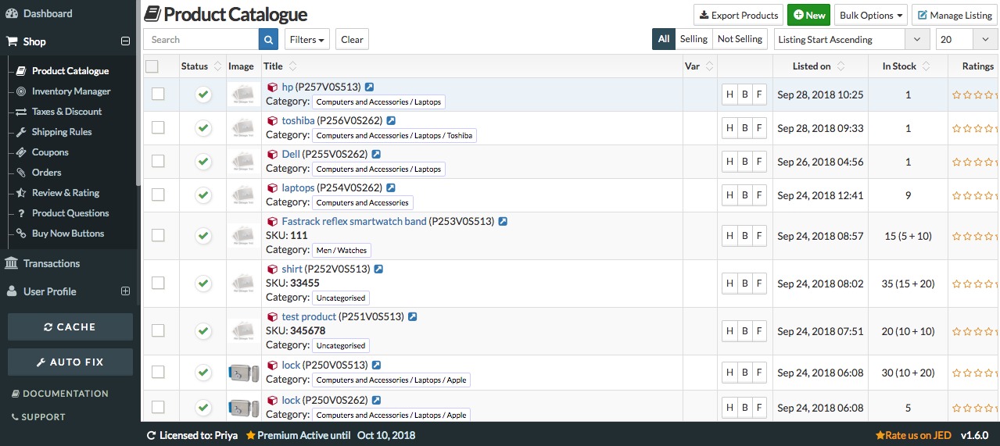
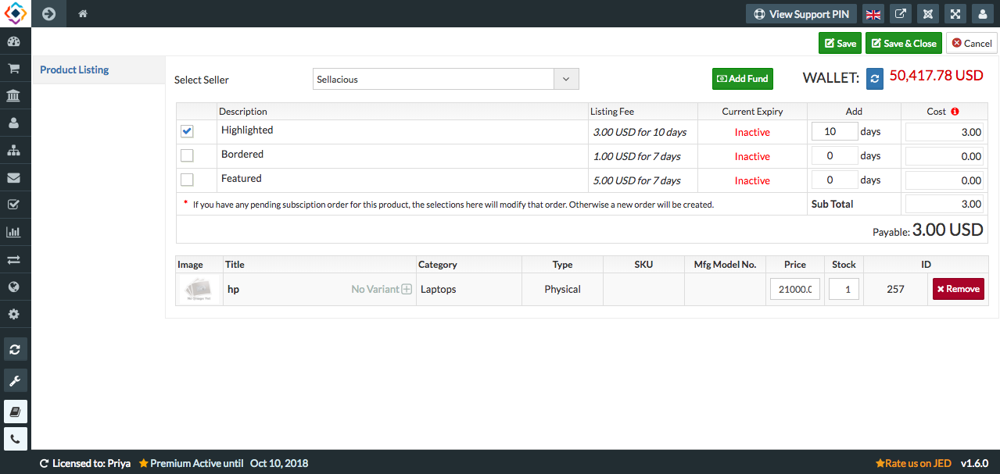
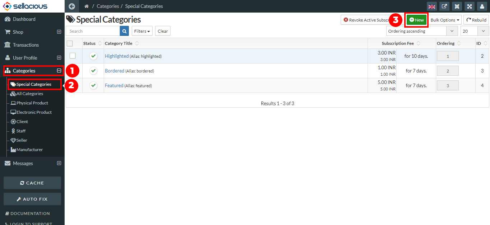

**You can Advertise the product by applying the special categories for the product.**

Special categories include **Bordered, Highlighted, featured**. If you want to change the products listing on the front end then you can use the highlighted, bordered and featured features.This listing is used to show the product more specifically in the frontend. You can change the stock and price of the product also from here. Basically,This option is available, when the paid listing is selected.

**In sellacious by default there are three special categories H, B, F.
**
**Note:** H,B,F represents the special categories for the products. You can assign them on products from here directly.
H stands for Highlighted feature, B stands for the Bordered feature, F stands for the featured feature.

**You can create the advertisement by assigning default special categories to products:**

1. Go to the sellacious panel of your website.
2. For adding default Special categories to your inventory, go to shop.
3. select product catalogue from the drop down menu.
4. In the product table, there will be one column which shows the special category H,B,F.

4. Select one special category which (H,B,F), you want to assign the product.
5. After selecting the special categories (H,B,F), a new window opens.

5. Select the number of days you want to assign the selected category to the products. You can assign one or more special category at once from here.
6. Click on save button to save the Special categories details.
7. Now the product is assigned to that Special Category.

**To create a new Special category.**
You can also create a new special category with the settings you want.

**Follow the following steps to create a new Special categories:**

1. Go to the sellacious panel of your website.
2. Go to categories, select special categories from the drop down menu.
3. In the special categories, click on new button on the top.

4. Submit the name of the special category and Fee Recurrence days. Fee Recurrence days are for how much time you want to assign the products in this category.
5. Submit the subscription fee, which seller will pay when he assign his products to this category. If you want to create a free special category leave amount to 0.00.
6. In badge options you can add the badge icon and style it for special category which will be visible on the right-top of the assigned products. You can also use badge text and style it the way you want.
7. In style options you can style the products for that special category, like their background and border.

8. Click on save.
9. And your new special category is created.