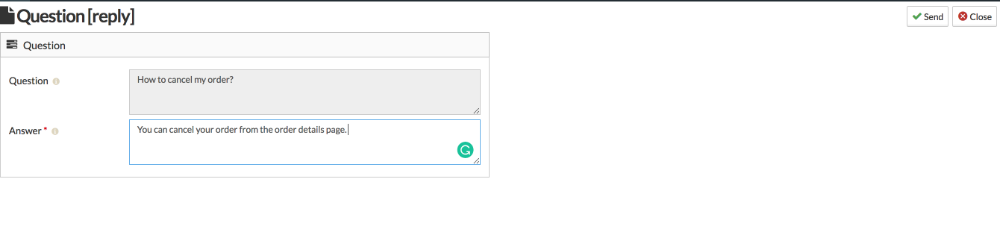
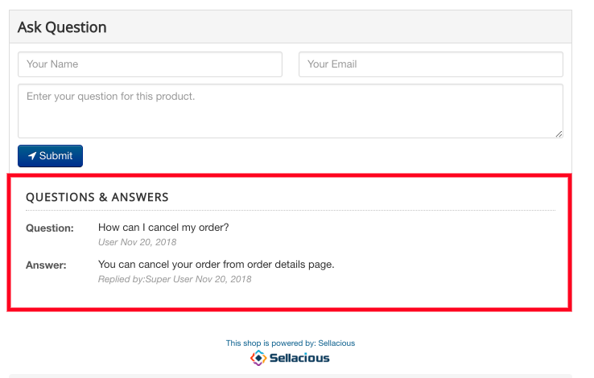

**Ask a question** feature is present on the sellacious panel in which User can ask any question on related to the product. User can ask any questions from the frontend.

---

**Steps to "Ask a Question" related to a Product:**

1. Go to the product page in the frontend.
2. At the bottom **Ask a question** section is presented on the product page.
3. If you're logged in already add your name, email and ask any question related to the product. And id=f you're logged in simply ask the question.
4. Click on the submit button.
5. And your asked question will sent to the admin/seller of that product.

---

**To answer the asked question as admin/seller, following steps are:**

1. Go to the sellacious admin panel.
2. Go to shop, and select **Product Question** from the drop down menu.
3. Questions asked on any product will be visible here for admin. However, seller will only see question related to his products.

5. Select the question and you'll be redirected to the new window.
6. Type your answer here and click send.
7. Your reply will be visible on the product for users.

**Note: 1. Only answered questions are visible on products.**
 **2. One question can have only one answer.**

---

**Configure Ask A Question:**

You can always configure Ask A questions settings.

You can do that from Sellacious backend > Settings > Global Configuration > General.

