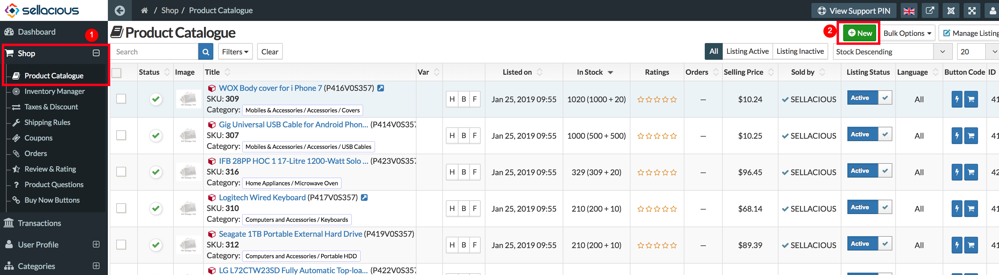
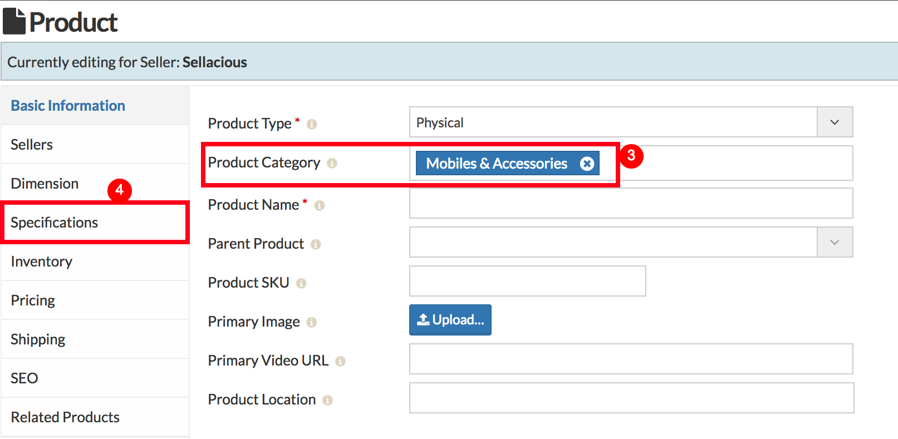
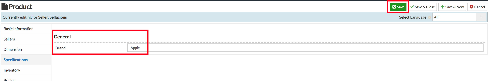
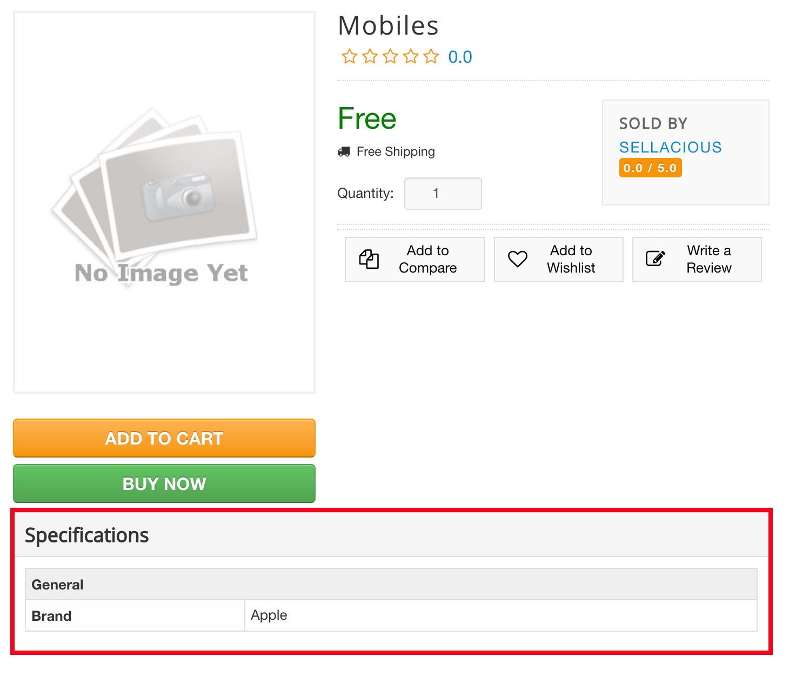

**_Specifications_** are added to a product to describe it precisely, a detailed description of the design and material used in its making. In the specifications tab are the product attributes and this tab is only available in a product when the category is selected. You can know more about the products attributes here. [What are products attributes?](https://www.sellacious.com/documentation-v2#/learn/additional-attributes/product-attributes)

---

**To submit the specifications of a product:**
1. Go to Sellacious backend > Shop > Product Catalog.
2. Click on New to create a new product.

3. Select the category for the product.
4. You'll see the specification tab in the product now. Specifications can be different for various categories.

5. Submit the product details and specifications.
6. Save the product.

7. In frontend, you can check the specification of the product.

