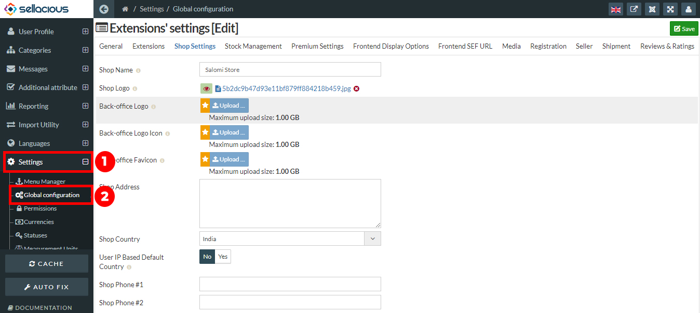
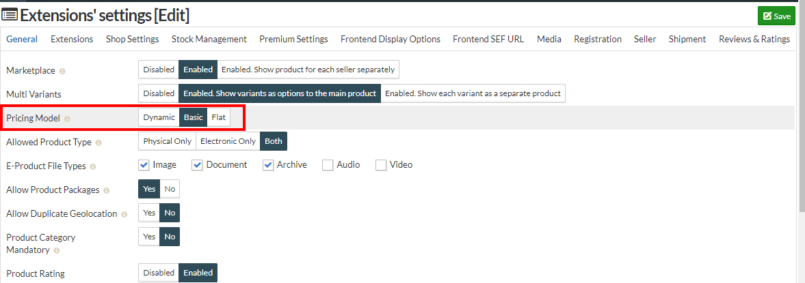

Dynamic pricing is a pricing type is USP of sellacious. With this pricing type you can set pricing for particular user group and also for definite time. It can also be described as offer price which will be applied and visible to only few customers group which you can select.This pricing consist of basic pricing type for each setting you want to set. You can set qty. limit in this pricing type and that price will only apply to that limit. 

You can set the dynamic pricing by the following steps:
1. Go to the sellaicous admin panel.
2. For creating the dynamic pricing, Go to the settings then select the global configuration from the drop down menu.

3. Go to the general tab then select the pricing model as dynamic.

4. Click on the save button to save the details of the dynamic pricing on the shop.