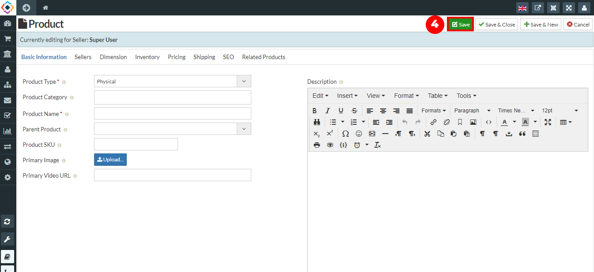

1. Go to the Sellacious panel of your website.
2. For adding products to your inventory, go to Shop and select Product Catalogue from the dropped down menu.
3. To create a new product, click on New button.

4. Fill the information about the product in different sections available in the Product window.

5. Click on Save button to save the product details, the product is successfully added to your inventory.
6. You can create other products by using above method.