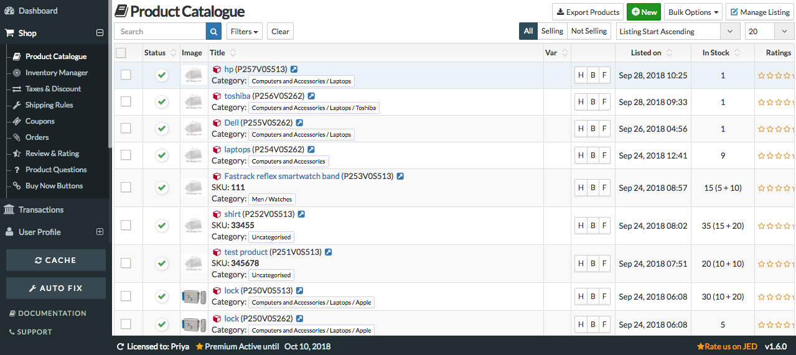
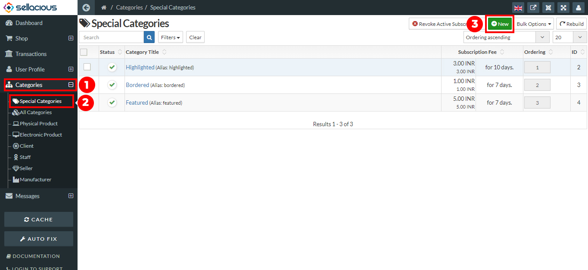

**You can Advertise the product by applying the special categories for the product.**

Special categories include **Bordered, Highlighted, featured**. If you want to change the products listing on the front end then you can use the highlighted, bordered and featured features.This listing is used to show the product more specifically in the frontend. You can change the stock and price of the product also from here. Basically,This option is available, when the paid listing is selected.

**In sellacious by default there are three special categories H, B, F.
**
**Note:** H,B,F represents the special categories for the products. You can assign them on products from here directly.
H stands for Highlighted feature, B stands for the Bordered feature, F stands for the featured feature.

**You can create the advertisement by assigning default special categories to products:**

1. Go to the sellacious panel of your website.
2. For adding default Special categories to your inventory, go to shop.
3. select product catalogue from the drop down menu.
4. In the product table, there will be one column which shows the special category H,B,F.

4. Select the category(H,B,F), you want to assign the product.
5. After selecting the special; categories(H,B,F), a new window opens.

5. Click on save button to save the Special categories details.
6. Now product is assigned to that Special Category.

**You can create a new Special category.**
If you want to assign a product to a new special category, you can create a new special category.

**Follow the following steps to create a new Special categories:**

1. Go to the sellacious panel of your website.
2. Go to categories, select special categories from the drop down menu.
3. In the special categories, click on new button on the top.

4. fill the credentials to create a new special category.

6. click on save.
7. And your new special category is created.

