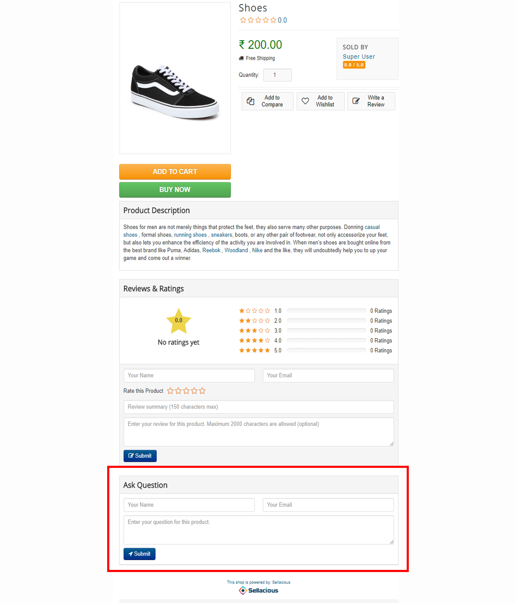
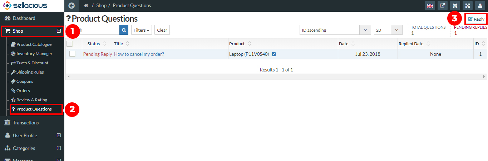

**Ask a question** feature is present on the sellacious admin panel in which User can ask any question on related to the product, which can be answered.User can ask any questions from the frontend.

**Steps to Ask a Question related to a Product:**

1. Go to the product page in the frontend.
2. At the bottom **Ask a question** section is presented on the product page.
3. Add your name, email and ask any question related to the product.
4. Click on the submit button.
5. And your asked question will sent to the admin/seller of that product.

**If the seller/admin wants to see or answered the asked question, following steps are:**

1. Go to the sellacious admin panel.
2. Go to shop, and select **Product Question** from the drop down menu.
3. Here all asked questions related the product will present. 

5. You have to just select the question and answer/reply that question.
6. And Click send.
7. Asked Question with reply will send.
8. Click on the send button to send the questions.

