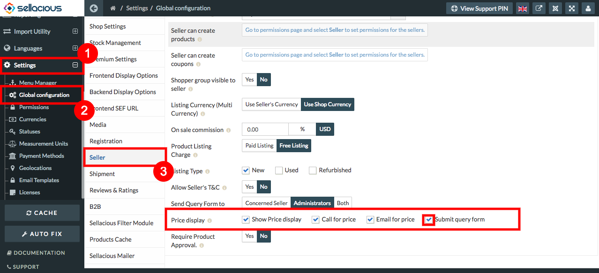
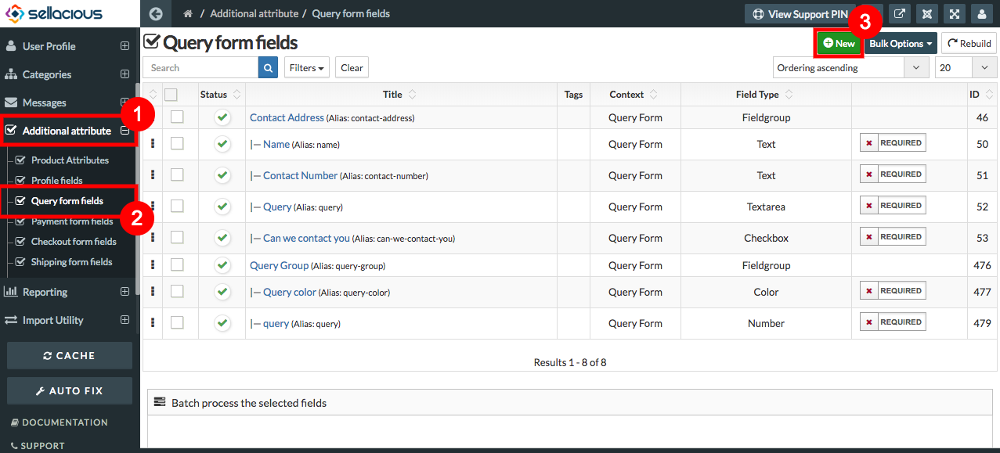
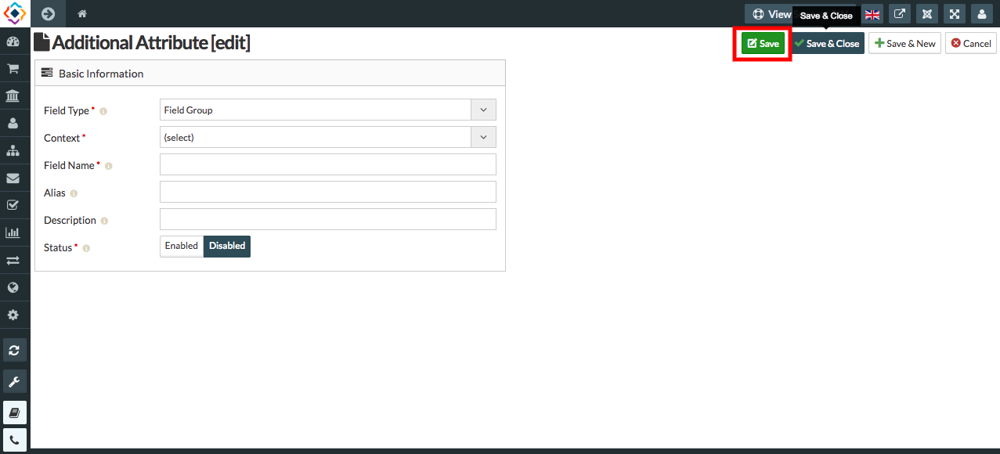
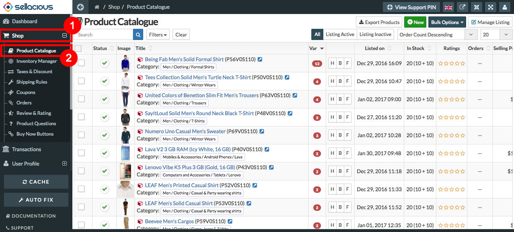
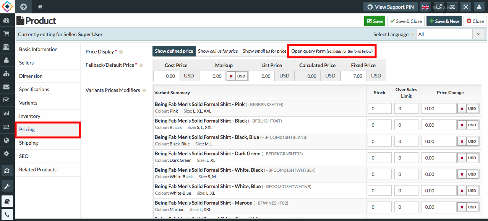
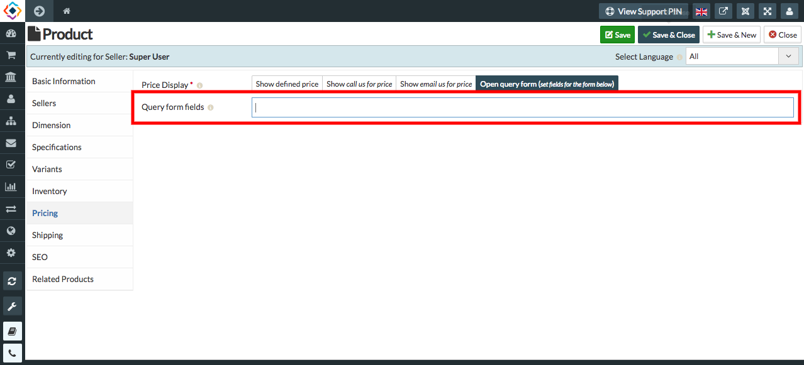

* **Query Form is a form by which customers can ask any query related to products.**
* **After enabling Query form from backend, it became mandatory for the consumers to fill the form.**
* **After submitting the form the price of the products will be shown to the consumers.**

##### **Enabling the Query form fields**

1. Go to the sellacious admin panel.
2. Go to the settings, select the global configuration from the dropped down menu.
4. Go to the seller tab, enable the **Submit query form** in the price display Field.

5. Click on the save button to save the details.

##### **Creating the query form fields**

1. Go to the sellacious admin panel.
2. Go to additional attribute, select **Query Form Fields** from the drop down menu.
3. To create new query form, click on new button.

4. Fill the credentials.
5. In the additional attribute section- Field type, Context, Field Name, Status Text Fields are mandatory.
6. Click on save button.

7. and New Query Form is added.

**Add the query form**

1. Go to the sellacious admin panel.
2. Go to the shop then select the product catalogue from the drop down menu.
3. Select the product, where you want to add query form.

4. Go to the pricing tab, select **open query form** option in Display Price field.

5. Add the query in **Query Form Fields**.

6. Click on the save.
7. And your query form will add to that product.

