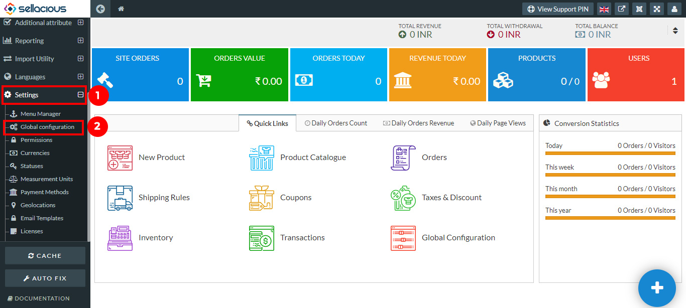
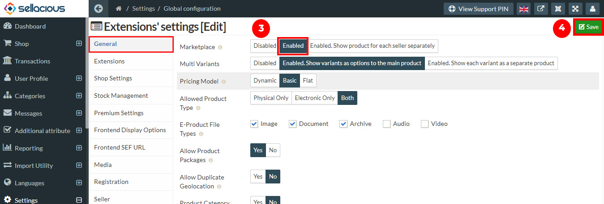

Mutli store means multi seller can sell the products with the seller.
You can set the multi seller with the following steps:

1. Go to the Sellacious panel of your website.
2. For adding products to your inventory, go to settings and select Global configuration from the dropped down menu.

3. To create a store as mulitseller, Go to the General tab.
4. You have to enable the marketplace by setting the marketplace as enabled.
5. Click on Save button to save the details.

6. Now you shop is setted as mutli store.