1. Download the sellacious software from-  https://www.sellacious.com/download
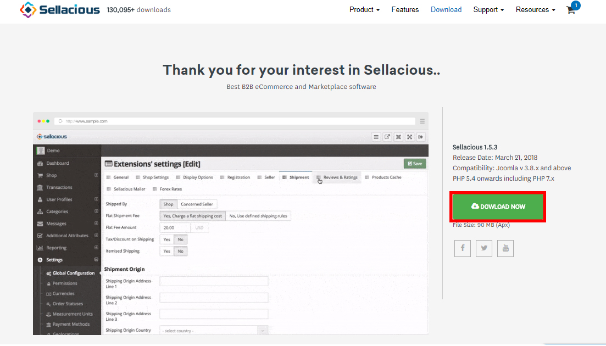
2. Once installed, Sellacious must be activated so that Sellacious can use many of its API. As soon as Sellacious is installed and launched, It asks for an active subscription. Subscription is a simple Email submit process.
a). After installing Sellacious, go to your Sellacious administration panel.
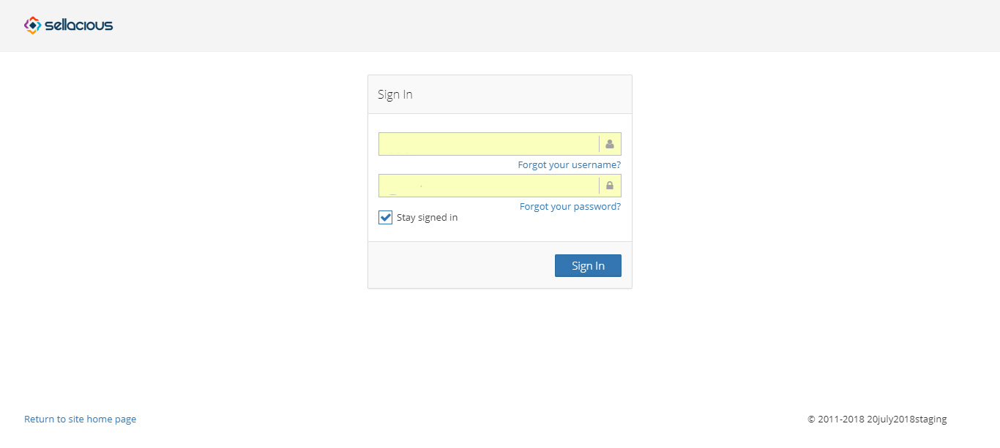
b). Once you log in to the panel, You can choose the subscription plan. There are four subscription to activate the sellacious. For beginners subscription plan is free and other subscription plan can be considered as the preimum plans.
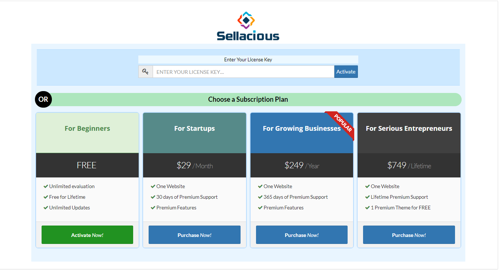
c). If you want to use free license then Purchase 'For Beginners'.

d). Complete the registration followed by verification.For verification, you will receieve an email for verify the code.![]

e). Complete the initial configuration of about store, shop settings and Premium Trial.
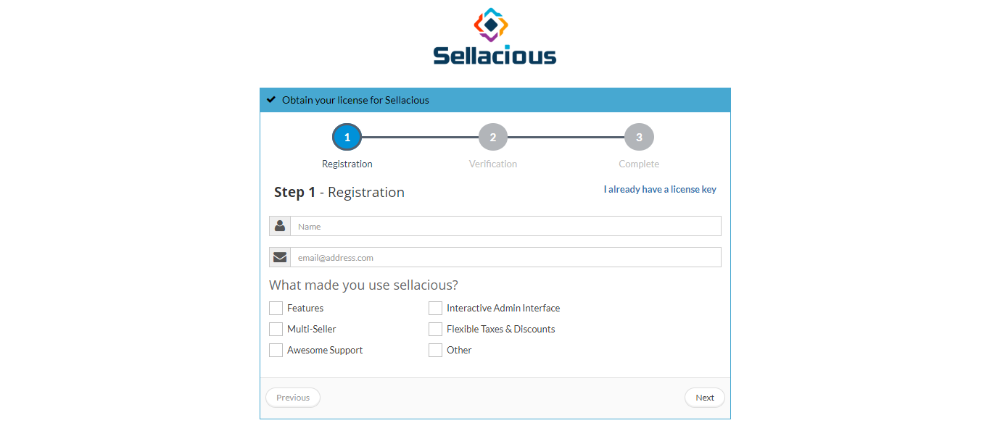
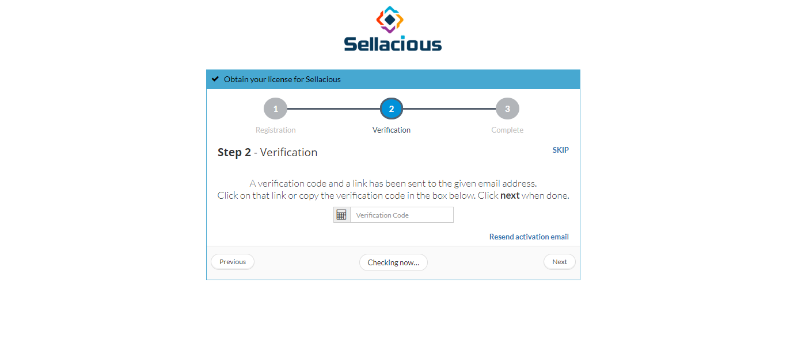
f). You will get an email regarding the license key.This can be used directly to activate your account.

g). Now your free license is activated, you can check it in your Sellacious panel.
3. While configuring sellacious first time, There are three steps to configure the sellacious by About Store, Shop settings and Premium Trial.
 **About Store**: You can Personalise your sellacious store.You can enter the name of your store,store email,store phone, shop address.Store name and store email are the mandatory fields of about store section. 

 **Shop settings**: Shop settings will configure your shop with few basic settings.It includes enable marketplace,store country,store currency. You can choose the options For enabling the marketplace by single seller and multiple seller. 
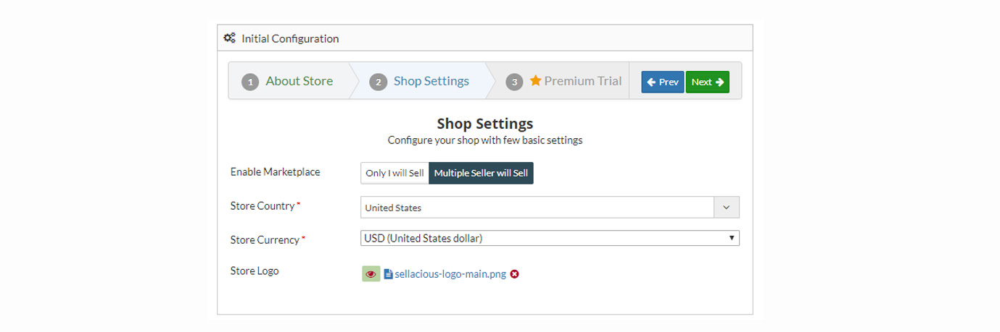
 **Premium Trial**: You can activate the premium trial from here.The premium Trial will be activated for 14 days.

4. Go to the Sellacious panel of your website.
5. **Creating product in your store**:
 a) For adding products to your inventory, go to Shop and select Product Catalogue from the dropped down menu.
 b) To create a new product, click on New button.

 c). Fill the information about the product in different sections available in the Product window.
    i) Select the product type.
   ii) select product category.
  iii) Enter the product name.
   iv) Upload the images and atatchements.
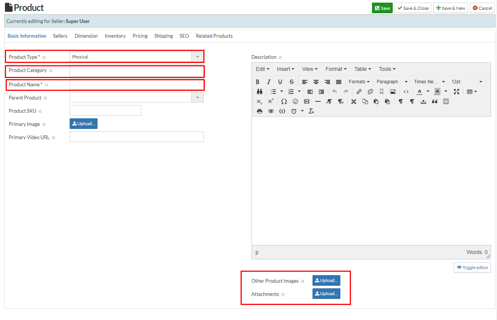
   iv) Fill the inventory details for your product.
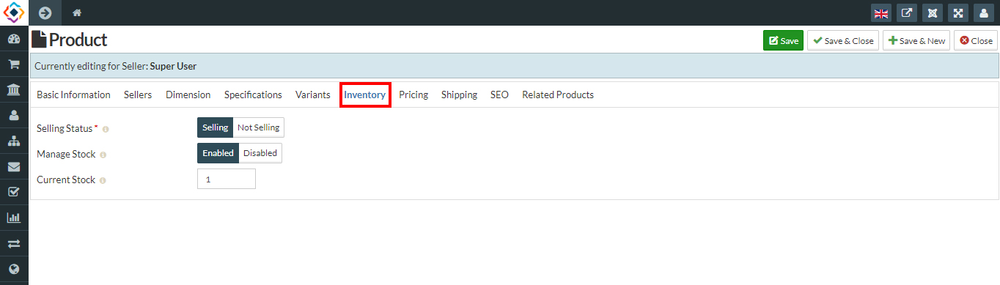
  vi) Enter the price of your product.
 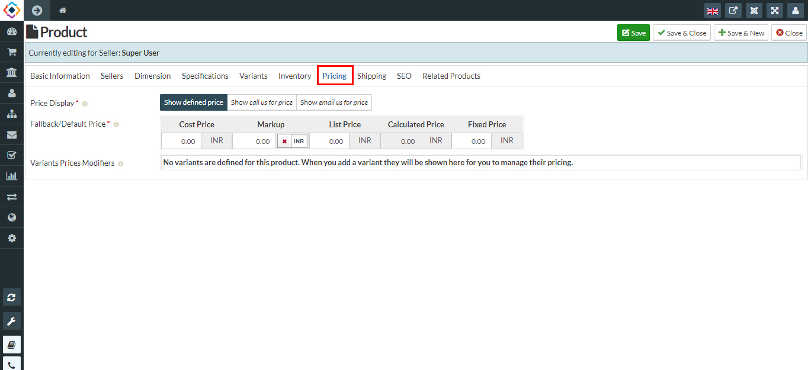
  vii) Click on Save button to save the product details, the product is successfully added to your inventory.
  d). Add variants for this product.
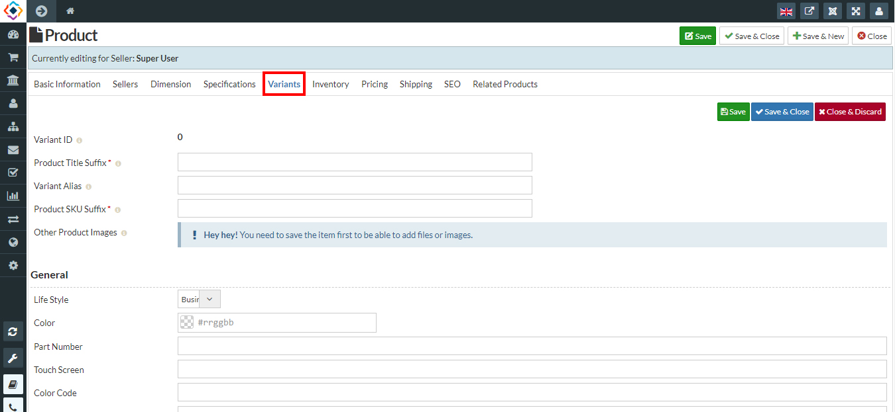

6. You can **Manage inventory** by Shop-> Inventory manager
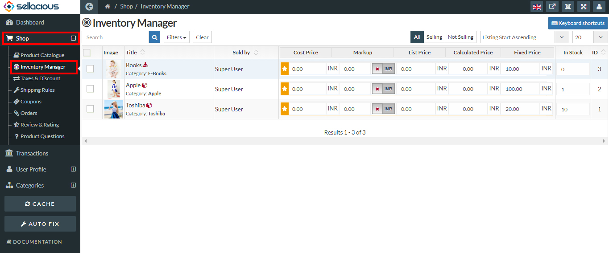
7. create **Taxes and disocunts** for your shop. Shop-> Tax and Discounts
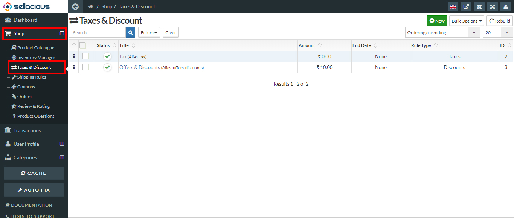
8. Create **Shippping rules** for your shop. Shop-> Shipping rule.
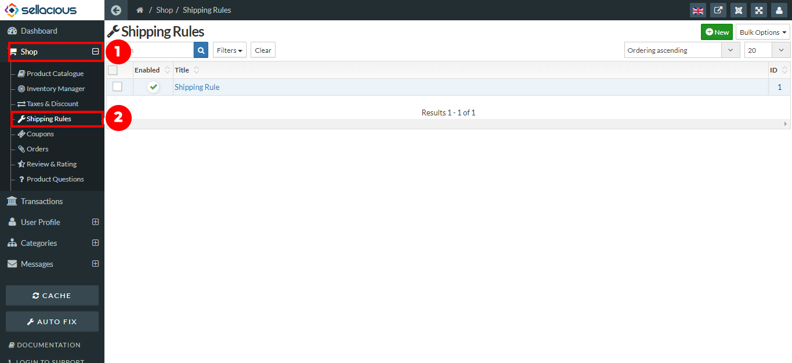
9. Create **Coupons** for your shop. Shop-> Coupons
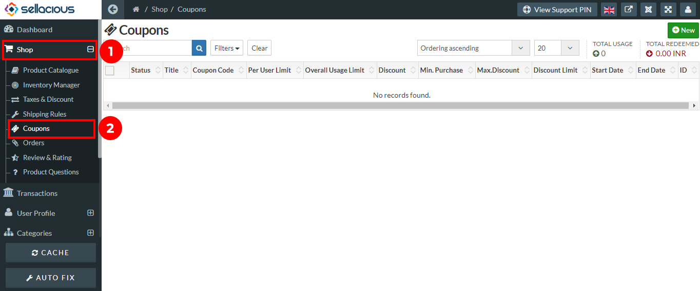
10. For **Creating plugin**, Go to the appstore https://www.sellacious.com/apps-and-integrations to add plugins and modules for your shop.

