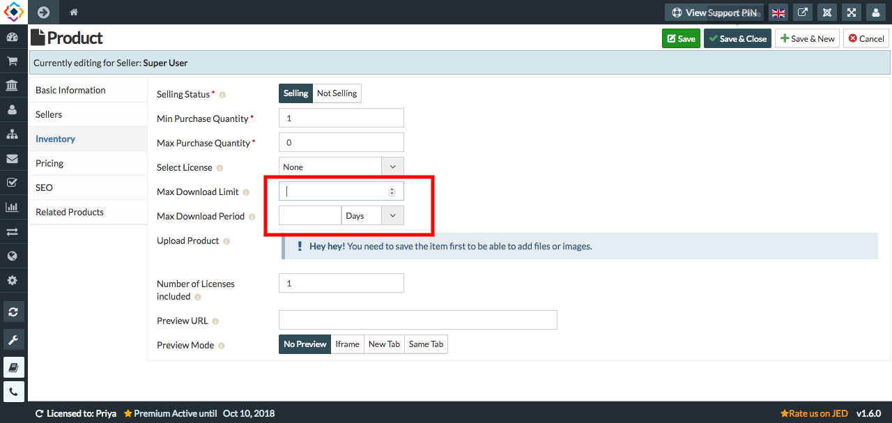

**For E-Product we can set the downloading limits.**

1. Go to the Sellacious panel of your website.
2. Go to Shop and select Product Catalogue from the dropped down menu.
3. To create a new product, click on new button.
4. In Product type, select Electronic as a type.
5. To set the download limit, Go to inventory tab on the left.
6. In inventory there are two columns- **Max Download Limit**, **Max Download Period**, to set the download limit.

8. In Max Download Limit, you can mention the value to make sure that the user can only download it no.of times.If in case Max Download limit is 5, then the user can download it only 5 times.
9. In Max Download Priod, you can mention the time. So, that till that time the user can download it.If in case Max Download Period is 6 days, then the user can download the **Max Download Limit**(value) till 6 days.
10. Click on Save button to save the product details.
11. And the Download limits of that product will be saved.
