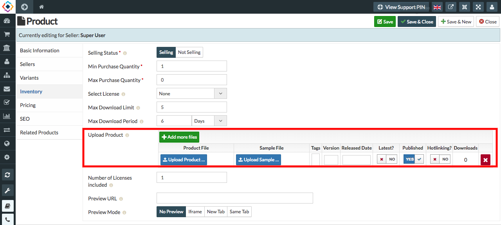
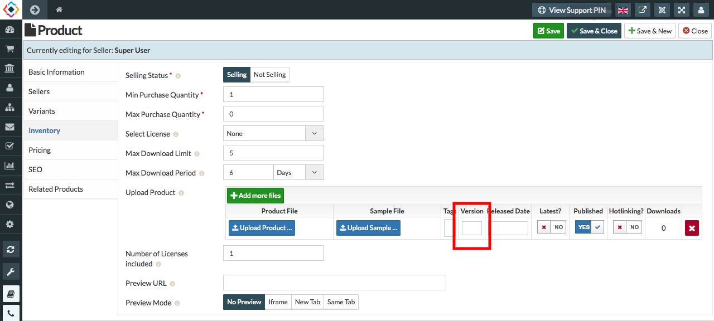

**You can add or edit the version of the Electronic Product by the following steps:** 

1. Go to the Sellacious panel of your website.
2. For Checking the version of the Electronic Product, go to Shop.
3. Select Product Catalogue from the dropped down menu.
4. To create a new product, click on new button.
5. In Product type, select electronic.
6. save the product.
7. After saving, open it and go to inventory.
8. In Upload Product column, select add more files.

10. In the version column of product you can set a version for that product or you can the change the version of that    product.

12. You can check or edit the file version from here.
13. Click on the save button to save the product details.