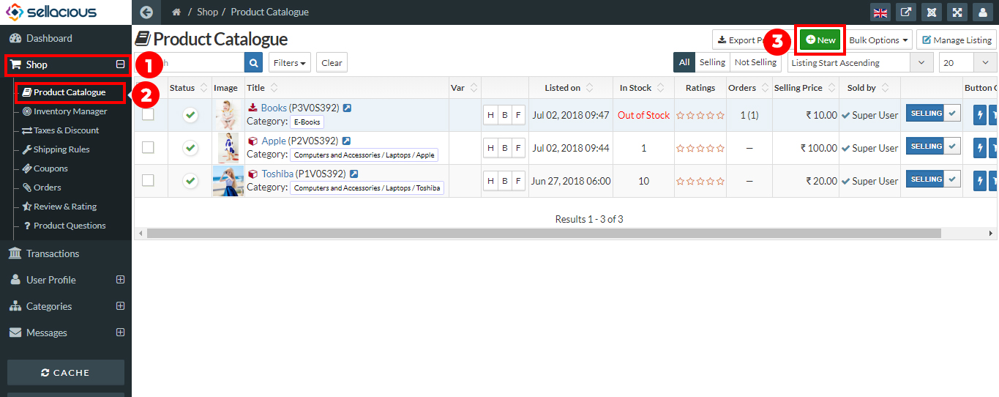
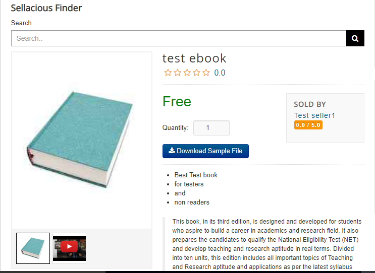

1. Go to the sellacious panel of your website.
2. For adding products to your inventory, go to Shop and select Product Catalogue from the dropped down menu.
3. To create a new product, click on new button.

4. Fill the information about the product in different sections available in the product window.
5. You can add images and videos
7. click on save button to save the product details, the product is successfully added to your inventory.
8. When you save the product for the first time then the upload option will be visible.You can upload the product image here.
  
     
  
  
     **Note: You can upload the videos for the E-Products only. **
8. Then you can save the product.
9. Now the uploaded image and videos are to be shown in the frontend of your webiste.
