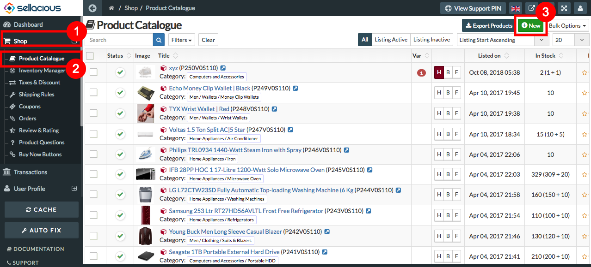
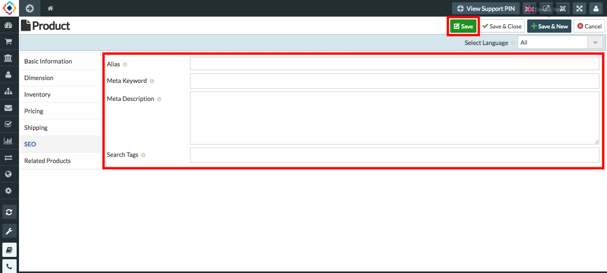
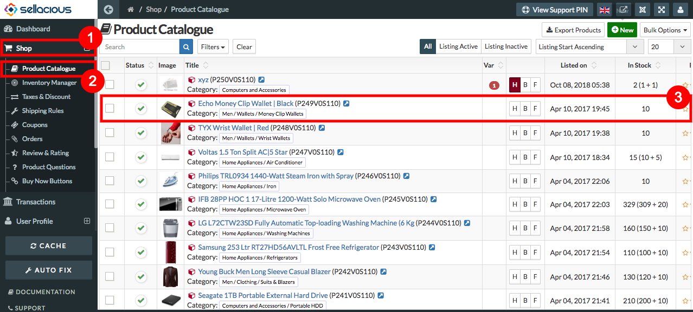
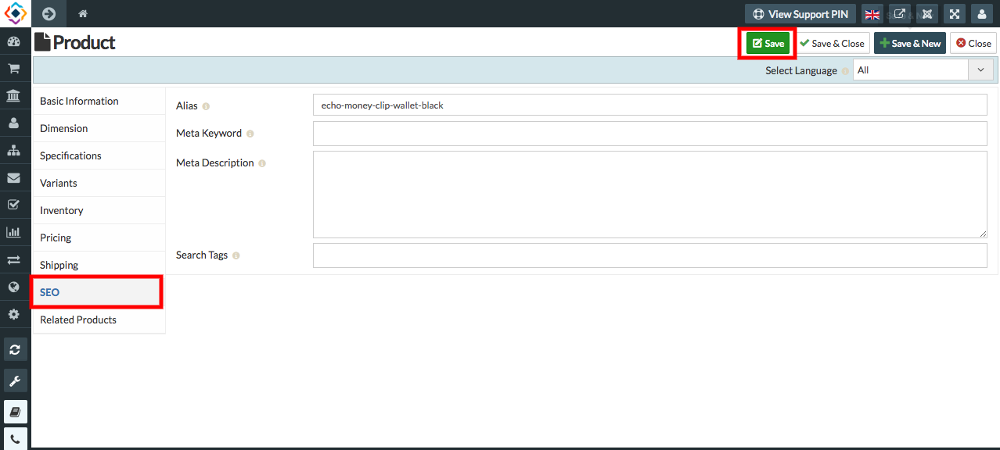

##### **SEO** stands for **Search Engine Optimisation**.
* Sellacious is SEO friendly.
* You can set alias,meta keywords, description and search tags.This will help to search a product very easily. 
* **Alias**: The Alias is a system generated name from the title.This is for internal tracking of records.You can leave this empty if you don’t understand its importance.It will be automatically generated. 
* **Meta Keyword**: Meta Keywords are a specific type of meta tag that appear in the HTML code of a Web page and help tell search engines what the topic of the page is. The most important thing to keep in mind when selecting or optimizing your meta keywords is to be sure that each keyword accurately reflects the content of your pages.
* **Meta Description:** Meta description is a tag of html,which summarizes a page content. You can add the description for the product and it will be saved as meta description. 
* **Search Tags**: Search Tags are similar to keywords but used in internal site searching purpose.Search tag will help you to search according to the tags you have created while creating the products.

##### **To create SEO tags for a new Product, Follow steps:**

1. Go to sellacious admin panel.
2. Go to shop, select product catalogue from the drop down menu.
3. click on new to create a new product.

4.Fill credentials or product detail.
5. On SEO section on the left, Fill credentials in Alias, Meta keyword, Meta description, Search tags Field.
6. save the product.

7. SEO tags for a new product is created.

##### **To create SEO tags for created Product, Follow steps:**

1. Go to sellacious admin panel.
2. Go to shop, select product catalogue from the drop down menu.
3. Select the prosuct for which you want to add SEO tags.

4. Go to SEO section on the left.
5. Fill credentials in Alias, Meta keyword, Meta description, search tags Fields.
6. save it.

7. Search tags for that product is created.

