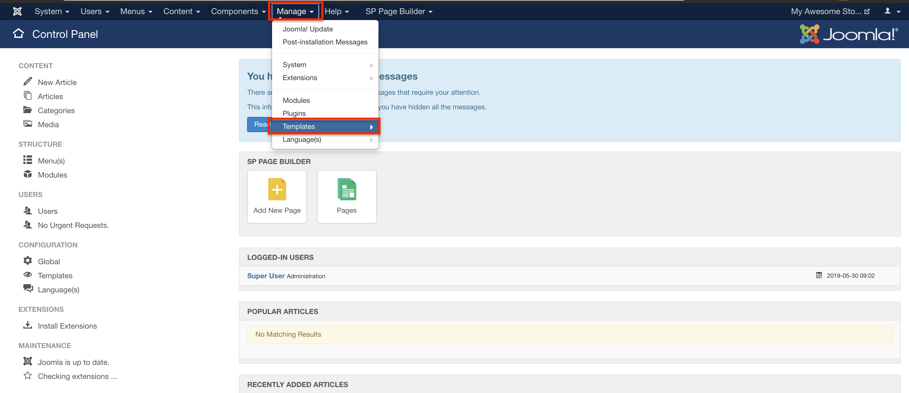
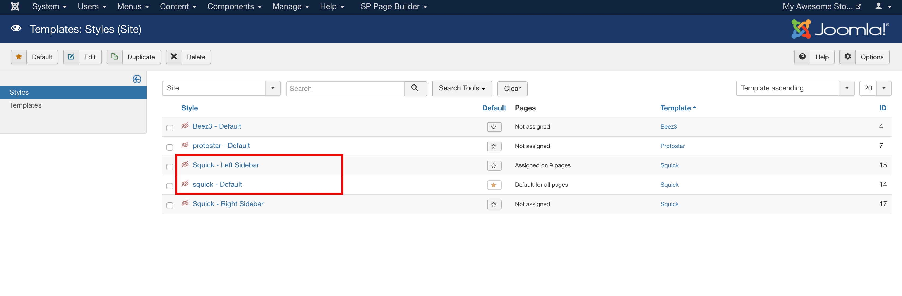

In sellacious, you can change the logo of your site easily. To do this, go to Joomla administrator your site. You can Joomla administrator yoursite.com/administrator.

Now, go to **Manage > Templates.**

Select the style or layout, in which you want to change the logo.

_Note: If you have more than one layout applied to your site you'll need to change the logo in all those layouts.
For example: In sellacious Squick, there are two layouts, default and left sidebar, while in js-kart there are four layouts. _

Now, in the **Basic tab**, you can change the logo for your site.

You can change or add the logo,logo for mobile, favicon and many from this section.

_Note: This document is for helix framework only._