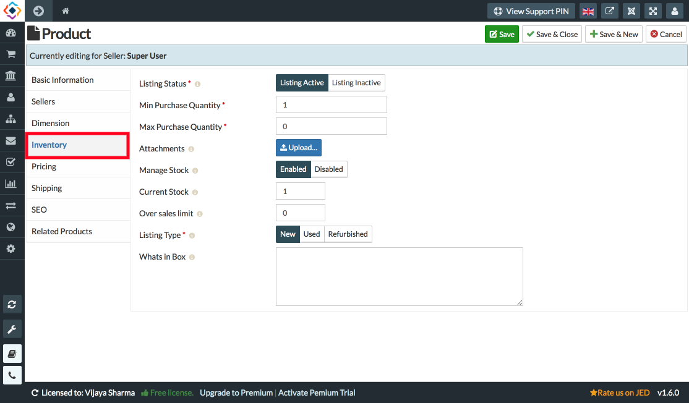

1. Go to the Sellacious panel of your website.
2. For adding products to your inventory, go to Shop and select Product Catalogue from the dropped down menu.
3. To create a new product, click on New button.

4. Fill the information about the product in different sections available in the Product window.
    i) Select the product type. [What are product Types?](https://www.sellacious.com/learn/product/product-type)
   ii) Select product category. [How to select Product Category?](https://www.sellacious.com/learn/product/product-categories)
  iii) Enter the product name.
   iv) Upload the images and atatchements. [How to Upload the images and attachments?](https://www.sellacious.com/learn/product/bulk-image-upload)

    v) Select the seller for which you want to create the product. You can always switch from current seller to other seller. [How to add/edit seller to the product?](https://www.sellacious.com/learn/product/add-edit-listing-of-seller) 
**Note: This section will be visible only to admin. Seller will not be able to add the products for another sellers if not permitted.**

   vi) Fill the inventory details for your product.

   vii) Enter the price of your product.
  viii) Click on Save button to save the product details, the product is successfully added to your inventory.
  d). Add variants for this product as varinats can be added only when product is saved.
6. You can create other products and their variants by using above method.