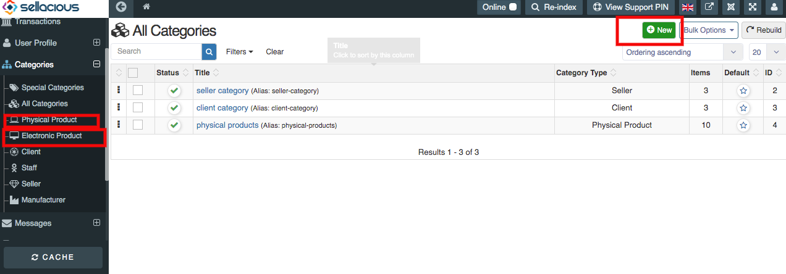
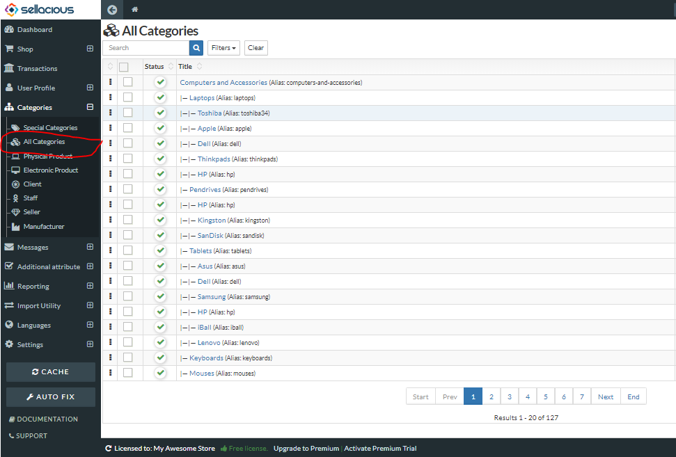

**To create the product categories, follow steps:**
1. Go to the Sellacious panel of your website.
2. Go to Categories and select the _Physical Product_ if you want to create a category for physical products. If you want to create electronic products, Select _Electronic Product_.
3. To create a new category, click on New button.
4. Fill the information about the category in different sections available in the category window. You can also view this link. [How to create a Product Category?](https://www.sellacious.com/learn/categories/product-categories)
5. Click on Save button to save the category details, the product category added successfully.

**You can apply the category for the partciular product by:**

1. Go to the sellacious panel.
2. Go to Shop > Product Catalogue. Click on New button to create a product or edit the already created product.
3. In the basic information tab select the category you want to assign the product. One product can have multiple Categories.
6. Fill the futher informtion of the product. [How to create a Product?](https://www.sellacious.com/learn/product/add-a-product)
7. Save the product. And category will be assigned to that product.