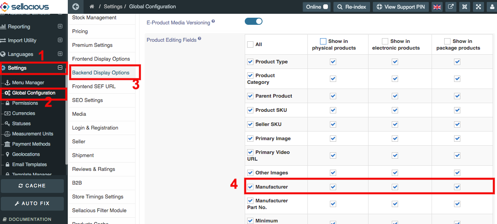
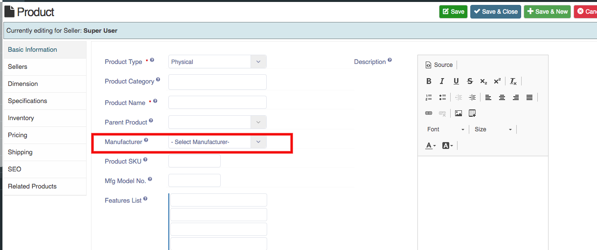
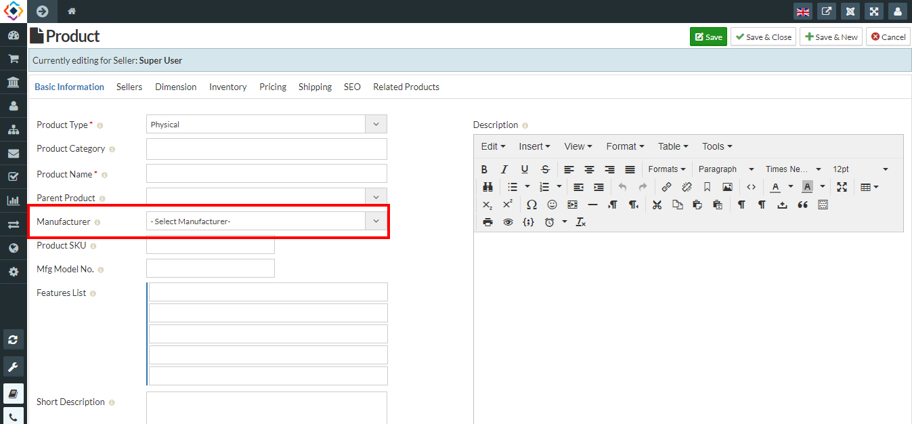
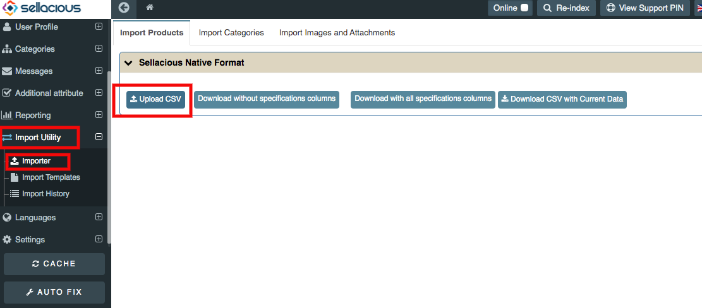

#### ### ## ### ###### # **User can mention manufacturer details in Manufacturer column.**

**By Default sellacious provide Manufacturer column, but user have to enable it.**

To enable Manufacturer column:
1. Go to the Sellacious panel of your website.
2. From left menu bar, go to the **Settings->>Global Configuration** from the drop down Menu.
3. Go to Backend display options.
4. Enable the option manufacturer for desired product type.

5. Save the changes you made.

Now Manufacturer will be available for the selected product type.

**You can add manufacturer or brand in product by the following steps:**

1. Go to the Sellacious panel of your website.
2. To add brand/Manufacturer to your product, go to **Shop->>Product Catalogue** from the drop-down menu. 

3. Click on the new button, Then on the basic information tab go to the manufacturer menu.

4. Select the manufacturer, If the manufacturer is not listed then create a manufacturer with the help of this [link](https://www.sellacious.com/learn/user-profiles/manufacturer-profiles).

5. Save the details by using the save button.

**You can add Manufacturer details through import method and the steps are:**

1. Go to the sellacious panel of your website.
2. To import, first navigate to import utility on the left side of panel. Then click on importer option  
   from  the drop-down menu.
3. In the Sellacious native format, select download with all specifications column and open the 
   downloaded file.
4. You can create a new product there and add manufacturer by filling credentials in 
   Manufacturer column.
5. Manufacturer columns are: MANUFACTURER_NAME, MANUFACTURER_USERNAME, 
   MANUFACTURER_CODE, MANUFACTURER_EMAIL, MANUFACTURER_COMPANY.
6. Fill needed columns.
7. If you want to add Manufacturer details for the created product then write Product_Title there 
   and add Manufacturer details.
8. Download the file in .csv format.
9. Again go to the import utility->>importer from left side menu.
10. In the Sellacious native format, select upload csv and upload the downloaded csv file.
11. Select options which you want to import in Import configuration.
12. Click refresh Cache from left sidebar.
13. And your changes will be updated.

You can mention Brand and Manufacturer name in Manufacturer option. But if you want to make a different column for Brand, create a new column Brand From Additional Attribute.

