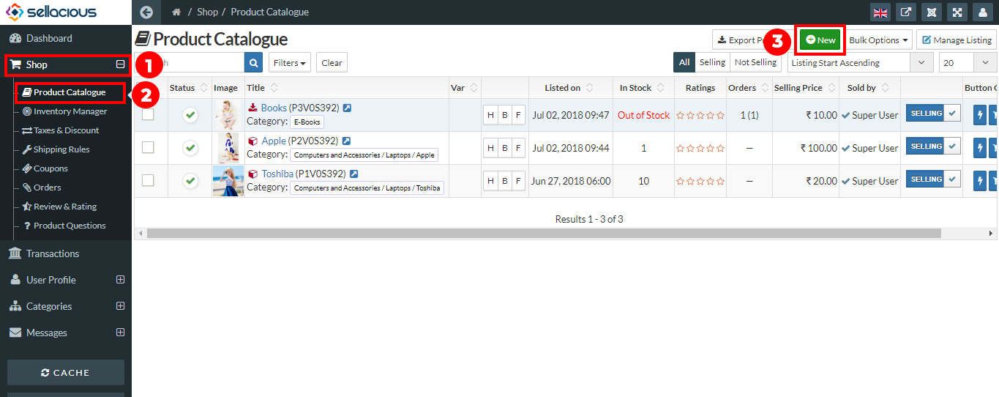

You can upload more than one images in products. You can also add a primary image and video (YouTube/Vimeo) in products. To upload images and videos in products follow these below steps:

1. Go to the sellacious panel.
2. In left menu bar go to **Shop->>Product Catalogue**.

3. Click on the new button to create new product. Create a product. Product creation process you can know from here. [How to create a product?](https://www.sellacious.com/learn/product/add-a-product)

4. You can upload Primary image and video URL from the basic information of the product. A product can have only one primary image.
5. To use the videos in product, paste the URL of YouTube or Vimeo in Video URL section.

6. If you want to upload more than one image for product, you can upload them in Other Product Images section.
7. You can upload the attachments for products in the Attachments section.

8. After this save the product and images and videos will be visible in the product.