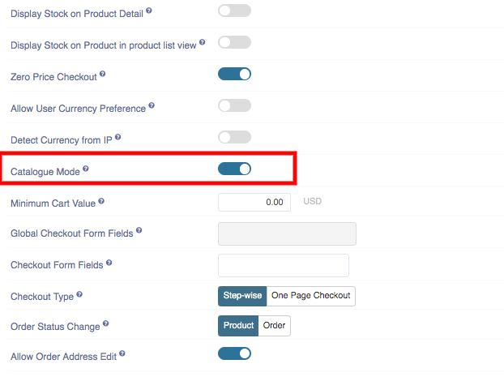

**Edited by:** Rashi Gupta
**Date:** 26-05-2020
**Compatibility:** Sellacious v2.0.0-Beta1+

This option is for when you don't want to sell products on your site. By disabling checkout, checkout options like buy now and add to cart buttons, won't be available on the frontend.

**To disable Checkout feature from your site:**
1. Go to Sellacious backend Settings->>Global Configuration->>Shop Settings.
2. You can found Catalogue Mode option.

3. If you want to disable checkout from your site enable Catalogue Mode option.
4. Save the configuration.
5. In frontend, checkout options are disabled.