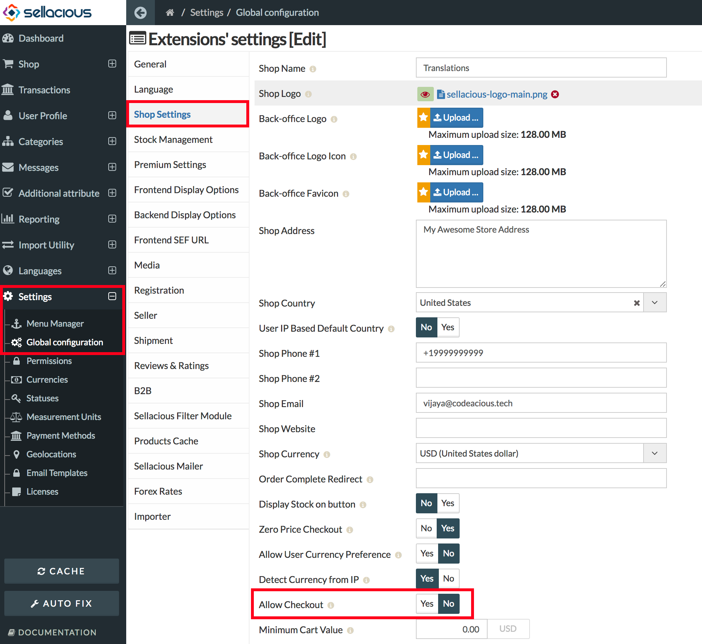

This option is for when you don't want to sell products on your site. By disabling checkout, checkout options like buy now and add to cart buttons, won't be available on the frontend.

**To disable Checkout feature from your site:**
1. Go to Sellacious backend > Settings > Global Configuration > Shop Settings.
2. Select _No_ for the **Allow checkout** option.

3. Checkout is disabled from your whole site.