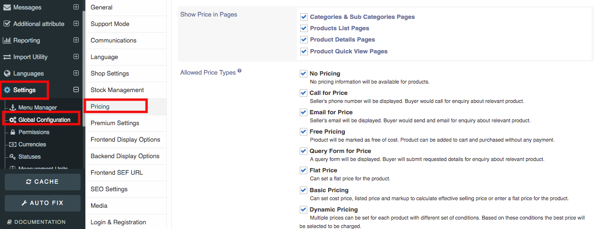
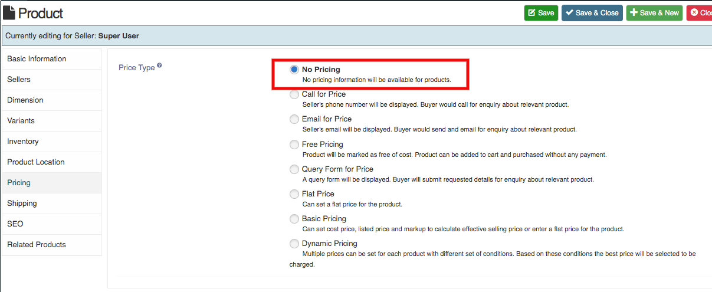
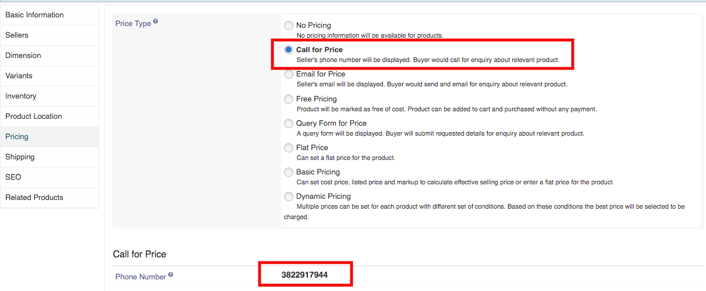
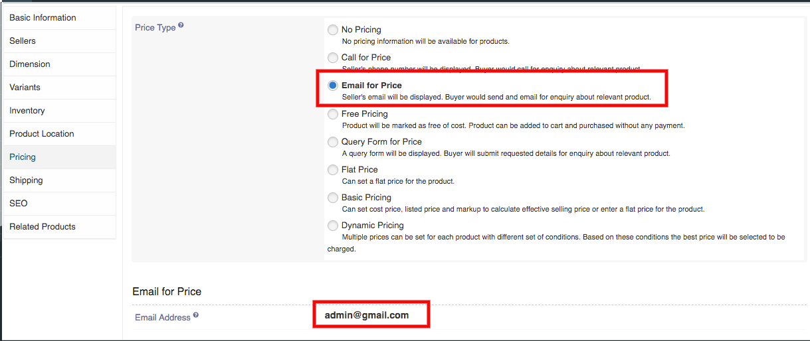

We have 8 type of pricing. To show pricing type in product, first go to the **Settings->>Global Configuration->>Pricing**. Select the pricing type which you want to show in your product.

In Category,

Pricing Types are:
1. No Pricing
2. Call for Price 
3. Email for Price 
4. Free Pricing
5. Query Form for Price 
6. Flat price
7. Basic Pricing
8. Dynamic Pricng

**1. No Pricing:** In no pricing type product, no pricing information is showing in product.

**2. Call for Price:** In call for pricing type product, sellers number is showing on product. Buyer need to call for the product to ask relevant information. 
**3. Email for Price:** In email for pricing type product, sellers email is showing on product. Buyer need to email send for the product to ask relevant information.
**4. Free Pricing:** In Free pricing type product, product is marked as free. Buyer can add this product in cart and purchase without any payment.

**5. Querry Form for Price:** In querry form for price poduct, querry form is showing. Buyer need to submit the enquirey form related to product.

**6. Flat Pricing:** In Flat pricing product, seller can set the flat pricing for the product.

**7. Basic Pricing:** In basic type product, seller can set cost price, listed price and markup to calculate effective selling price.

**8. Dynamic Pricing:** In dynamic pricinf type product, seller can set multiple prices for each product with different set of conditions.
