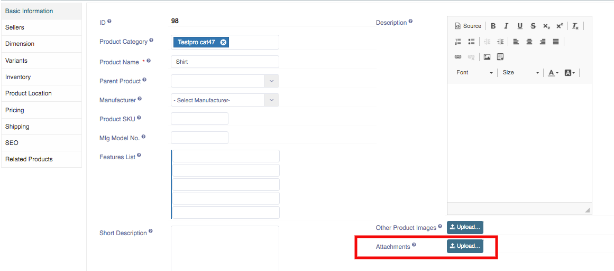

An attachment can be a picture, a word document, a movie, a sound file, an Excel document, or any other file that requires another program to open it.
Here you can upload any relevant documentation or files to this product. 
1. Go to the Sellacious panel of your website.
2. For adding products to your inventory, go to Shop and select Product Catalogue from the dropped down menu.
3. To create a new product, click on New button.

4. You can upload the attachment in the product catalogue window.

5. Click on Save button to save the product details, the product is successfully added to your inventory.
