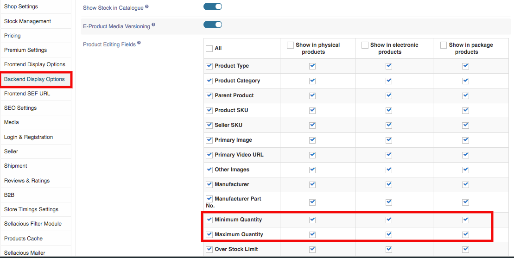
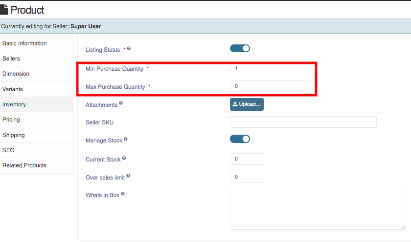

**Minimum and Maximum Quantity** Numeric values should be whole numbers.

**Minimum quantity** – Customer must purchase more than this amount.
**Maximum quantity** – Customer must purchase less or equal to this amount.

By Default sellacious provide Minimum & Maximum Quantity column, but the user have to enable it.

**To enable Minimum & Maximum Quantity column:**

1. Go to the Sellacious panel of your website.
2. Go to Settings->>Global Configuration->>Backend Display Options.
3. Check Minimum & Maximum Quantity  in all columns.
4. Save the changes you made.

Now Minimum & Maximum Quantity option will be available in product.

**You can add Minimum & Maximum details through import method and the steps are:**

1. Go to the sellacious panel of your website.
2. To import, first navigate to import utility on the left side of panel. Then click on importer option  
     from  the dropped down menu.
3. In the Sellacious native format, select download with all specifications column and open the 
     downloaded file.
4. You can create a new product there and add Minimum & Maximum by filling credentials in 
     Minimum_Quantity and Maximum_Quantity column.
5. If you want to add Minimum & Maximum details for the created product then write 
    Product_Title there and add numeric value in Minimum_Qunatity and Maximum_Quantity.
6. Download the file in .csv format.
7. In the Import utility on the left panel, selects importers.
8. In the Sellacious native format, select upload csv and upload the downloaded csv file.
9. Select options which you want to import in Import configuration.
10. Click refresh Cache from left sidebar.
11. And your changes will be updated.

