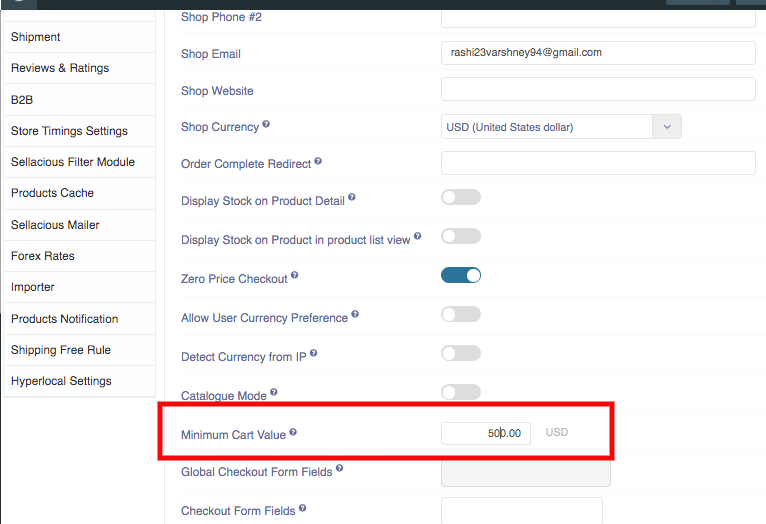

**Minimum Cart value :**  You can set a minimum price for the users to checkout. If you set the minimum cart price is 500$ then the buyer can not checkout, If the cart value is less than 500$.

**You can set the Minimum Cart Price through following steps:**

1. Go to the Sellacious panel of your website.
2. Select setting menu from left menu bar.
3. Click on global configuration.
4. In Extension’s setting click on shop settings tab.
5. There will be a field named Minimum Cart Value.
6. Enter the value there.
7. And the user can only checkout, If the total price will be equal or greater than the Minimum Cart Value.
8. If the total price is lesser than the Minimum Cart Value then he will not able to checkout.
9. Click on Save button to save the details, the Minimum Cart Value is successfully added.

